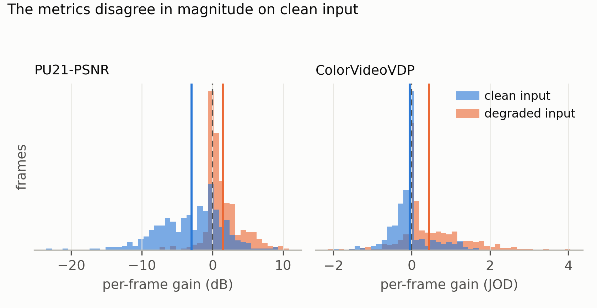
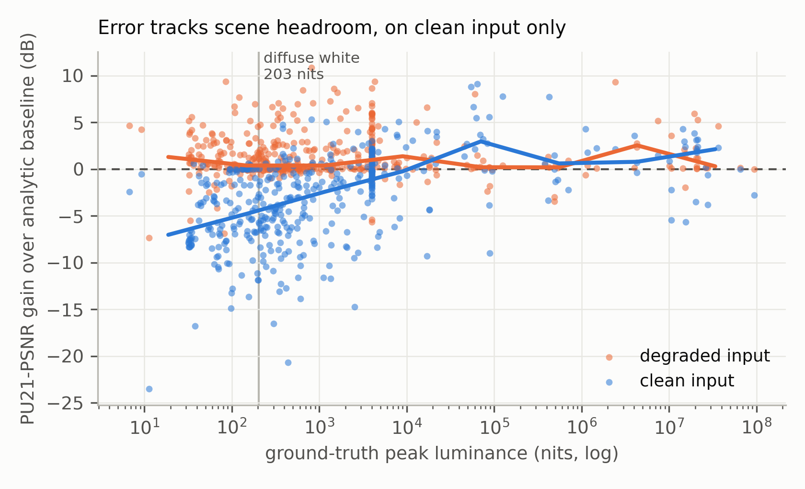
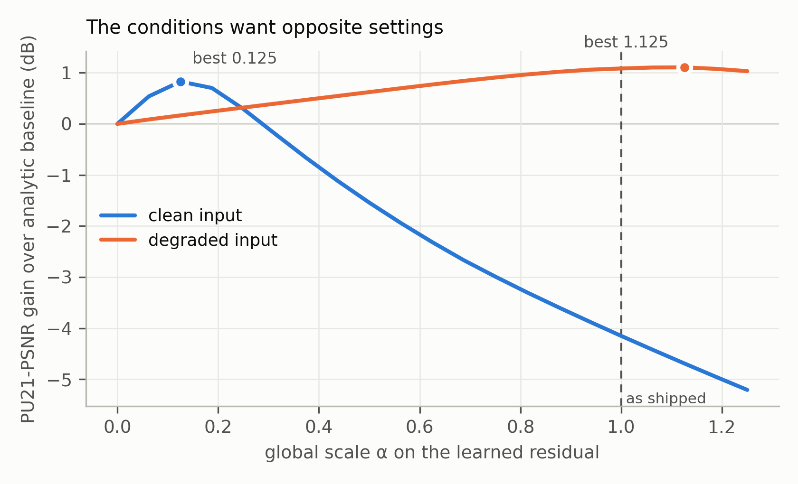

# What an 8-Bit Frame Can and Cannot Say About the Scene Behind It

*Bounds for inverse tone mapping, and a gate that reaches one of them.*

**4 September 2026.** Supersedes the §6/§7.1 tables flagged as blocking in
`PAPER_ERRATA.md`. Every number below is measured, and the command that produced
it is named.

---

## Abstract

We train a compact network for single-image SDR-to-HDR reconstruction and
evaluate it against its own analytic inverse tone map on 429 held-out frames in
PU21-PSNR and ColorVideoVDP JOD. On degraded input — an unknown tone curve,
4:2:0 chroma, banding and JPEG, the condition real footage arrives in — the
model gains **+1.43 dB and +0.44 JOD**, winning **348 of 429 frames (81%)**. On
clean, well-graded input it *loses* **3.0 dB** of PU21-PSNR while CVVDP puts the
same gap at **−0.046 JOD**: a two-order-of-magnitude disagreement between the
metrics that is itself the result.

The clean regression is not uniform. It concentrates entirely in
low-dynamic-range frames: the 60 worst average **−10.76 dB** at a median
ground-truth peak of **238 nits**, the 60 best **+3.41 dB** at **19,590 nits**,
with correlation **+0.46** between gain and `log2(peak_nits)`. The model has no
representation of how much headroom a frame has, and so cannot decide to do
nothing. The penalty is carried by the tail of the error distribution rather
than its bulk (§6), which is itself a caution about the metric.

We then measure what fixing that would be worth, and whether it can be fixed. An
oracle per-frame scale on the residual is worth **+5.84 dB on clean and +0.29 dB
on hard simultaneously**, and no constant achieves it — clean wants 0.125, hard
wants 1.1, and the constant that fixes clean discards 85% of the hard gain. But
a linear readout of the features such a gate would use explains only **3%** of
that scale's variance, and **79% of the variance is within a condition rather
than between**, so even a perfect clean-versus-degraded classifier caps at
R² 0.213. The remaining 79% asks whether a clipped region was a 200-nit lamp or
a 20,000-nit sun — a question an 8-bit frame does not answer.

**But that bound is a property of the question, not of the problem.** Posed as a
continuous per-frame scale it is unreachable. Posed as a *binary* decision on
the one axis that is detectable — is this input clean or degraded? — it is
reachable, and we build it. A 21,121-parameter gate on the shadow arm of the
reconstruction, supervised on a label we generate ourselves, moves clean input
by **+3.41 ± 0.32 dB and +0.135 ± 0.023 JOD** over the shipped model while
giving up **0.30 ± 0.15 dB and 0.091 ± 0.041 JOD** on degraded input, over three
training seeds. All three are positive on all four measures against the analytic
baseline — the only configuration we scored of which that is true — and all
three have a clean CVVDP above every fixed alternative, including both ends of
the ablation the gate interpolates.

Against a published method on the same 429 frames — ExpandNet, run from the
authors' released weights — RUDRA is **+18.56 dB and +2.03 JOD**. Both metrics
agree there, which is worth stating beside the disagreement above: the
two-order-of-magnitude gap is a property of *small* differences on well-graded
input, not a defect in either instrument.

Our contribution is therefore two measurements and one component: an account of
where the ceiling sits and why — **the achievable gain is bounded by the
information in the SDR input, not by model capacity, corpus size, or training
objective**, each of which we vary and none of which moves it — and a
demonstration that decomposing the problem along the detectable axis recovers
most of what the bound appeared to forbid.

---

## 1. What is claimed, and what is not

This paper reports a **direct SDR-pixel to scene-linear-radiance image model**.
It does not report the DRE-transformer / cross-attention architecture described
in the earlier manuscript: that design has never been trained, and per
`PAPER_ERRATA.md` §2 the results attributed to it were aspirational. The
"HDR-VDP-3" column of the previous §6 corresponded to no metric this codebase
ever computed (`PAPER_ERRATA.md` §1). Both are withdrawn.

What follows is the system that exists, measured with the metrics that exist.

---

## 2. Related work

> **Note on citations.** Every reference below was checked against the publisher or
> author page for authors, title, venue and year; the one-line method
> descriptions are at the level the titles and abstracts support. No number in
> this paper is attributed to any of them — we compare against our own analytic
> baseline and against ExpandNet (§5.1), and §9 says which comparisons are still
> missing. The failure mode
> this caution replaces — placeholder tables presented as measurements — is
> documented in `PAPER_ERRATA.md`.

**Single-image inverse tone mapping.** The dominant framing learns a mapping
from an 8-bit frame to a higher-range one, typically with an encoder-decoder and
a loss in a perceptual or log domain, and typically evaluated on synthetically
clipped data. Eilertsen et al. [1] predict a log-domain reconstruction of the
saturated regions with a U-net and blend it back through a saturation mask;
Marnerides et al. [2] combine three branches at different receptive fields;
Endo et al. [3] instead synthesise a bracketed exposure stack from the single
input and merge it; Liu et al. [4] decompose the task into learned inverses of
the individual camera-pipeline stages. Our architecture is deliberately smaller
than this line of work (1.2 M parameters) and is a *residual on an analytic
inverse tone map* rather than a direct predictor, which is what makes "does the
network beat doing nothing?" a question we can ask at every step of training.

**Highlight and clipped-region reconstruction.** A related family treats the
problem as inpainting the saturated regions specifically, rather than remapping
the whole frame; Santos et al. [5] make the clipped area explicit by masking it
out of the network's own features and adding a perceptual loss, and the masked
blend in Eilertsen et al. [1] serves the same end. Our highlight and shadow
masks share that purpose, but are predicted jointly with the residual and gated
by a luminance prior rather than by a detected saturation mask. §6 is a direct
criticism of that choice: our own failures are not in the clipped highlights at
all.

**Evaluation of HDR reconstruction.** PU21 [6] and ColorVideoVDP [7] are the two
public measuring sticks we use — the first an encoding that makes existing
metrics such as PSNR applicable to absolute-luminance HDR, the second a
calibrated visible-difference predictor reporting in JOD. §5 reports a case
where they disagree by two orders of magnitude in magnitude on the same frames,
and §6 shows the PU21 penalty is only partly tail-carried; we are not aware of
that disagreement being characterised for this task, and it is a contribution of
this paper independent of the model.

**Training data for HDR.** The scarcity of paired SDR/HDR footage shapes every
result here. Public HDR video with cinematic production values remains small
enough to enumerate — the HDM-HDR-2014 set of Froehlich et al. [8] contributes 9
scenes and 11,007 frames to our corpus — and the widely used HDR still sets
[9] are bracketed-exposure captures rather than graded footage. The remainder of
our corpus is proprietary. §4 documents a distribution shift between our own
training and held-out splits that we did not design and that a reader should
weigh.

**What we compare against.** ExpandNet [2] is scored on our split in §5.1, using
the authors' released weights and their own pre- and postprocessing.
`rudra bench --test-dir <method>` scores any third-party output against the same
reference, so the other three are a matter of running their code, not of
building anything. §9 says which.

---

## 3. Method

### 3.1 Storage and units

HDR targets are stored in `log2_extended`: 0.005 to 1,000,000 nits at 2,377
codes per stop. Network units are **nits / 10,000**, so 1.0 is 10,000 nits and
diffuse white (BT.2408, 203 nits) is 0.0203. The network clamps its output at
`max_hdr = 4.0` (40,000 nits).

### 3.2 Architecture

A compact U-Net (`rudra/sdr2hdr.py`, **1,196,197 parameters**, 4.6 MiB float32)
predicts three fields from the SDR frame and its analytic inverse-ACES baseline:
a log-domain residual, a highlight mask and a shadow mask. The composite is

```
pred_log = clamp(log1p(baseline · 16) + residual · gate,  0,  log1p(max_hdr · 16))
pred     = expm1(pred_log) / 16
```

where `gate = max(σ((y − 0.82)·24), σ((0.10 − y)·24))` is a per-pixel luminance
prior: the learned residual is applied where clipping or crushed shadows made
the SDR mapping non-invertible, and the physically-grounded analytic baseline is
preserved through ordinary midtones. Note for §5: this gate sees **one pixel's
brightness and nothing else**.

### 3.3 Censored observations

A pixel sitting on a source's delivery ceiling means "≥ ceiling", not
"= ceiling"; plain L1 against those pixels teaches the model to cap highlights.
The loss is one-sided there, with `CENSORED_HEADROOM_STOPS = 3.0` of free
reconstruction above the ceiling before the excess is charged, so a one-sided
loss cannot run every clipped highlight to `max_hdr`. Censoring is a small
effect on this corpus in practice: `censored_fraction` averages **0.0003**.

---

### 3.4 Training setup

| | v5 (shipped) | v6 (capacity ablation) |
|---|---|---|
| base channels | 32 | 64 |
| parameters | 1,196,197 | 4,770,117 |
| crop | 384 | 384 |
| batch × grad-accum | 2 × 2 | 2 × 2 |
| optimiser | AdamW, lr 2e-4, wd 1e-4, cosine to 5% | same |
| gradient clip | 1.0 | same |
| degradation probability | 0.65 | same |
| scene-balanced sampling | yes, 40% video mass | same |
| steps | 100,000 | 100,000 |
| eval | every 1,000 steps, 256 held-out crops, both conditions | same |
| selection | `composite_gain = hard_gain + min(0, clean_gain)` | same |
| hardware | one NVIDIA RTX 4080 SUPER | same |
| seed | 20260715 | 20260715 |

The corpus manifest is pinned by SHA-256 in every checkpoint's `config.json`, so
a run can be tied to the exact record set it saw.


## 4. Corpus, splits, and a distribution shift we did not intend

27,678 training / 435 validation / 429 test records; val and test are 97 scenes
each at 1280×720. Sampling is scene-balanced with a 40% video mass. The only
publicly redistributable component is the HDM-HDR-2014 set of Froehlich et al.
[8] (9 scenes, 11,007 frames, median 5.99 stops of measured dynamic range); the
remainder is proprietary FXTD Studios footage, which is why §10 ships the
manifests and the scoring harness rather than the corpus.

The held-out splits are **not** drawn from the training distribution:

| | median peak | < 1000 nits | < 400 nits | video share |
|---|---:|---:|---:|---:|
| train, as sampled | 1,713 nits | 42.2% | **27.2%** | 40.0% |
| val | 548 nits | 69.0% | 38.2% | 33.8% |
| test | 546 nits | 58.0% | **45.2%** | 32.9% |

The band in which the model fails (§6) is **45.2% of the test split and 27.2% of
what the sampler draws**. We report this because it is a confound in our own
results, and because §6 shows it is not the binding constraint.

---

## 5. Results

`training/export_bench_pairs.py` renders each held-out record at native
resolution into scene-linear EXR trees; `rudra bench --nits-scale 203` scores
them. Both conditions use the same unclamped reference — clamping the reference
at the network's own ceiling would score the model against a ground truth
cropped to its own limits. `hard` applies a seeded camera/codec degradation.

**429 frames, PU21-PSNR and ColorVideoVDP JOD, against the analytic baseline:**

| Condition | Method | PU21-PSNR (dB) | CVVDP (JOD) |
|---|---|---:|---:|
| clean | analytic baseline | **45.99** | 9.448 |
| clean | v5 (32 ch, step 81,000) | 42.99 | 9.402 |
| clean | v6 (64 ch) | 43.24 | 9.452 |
| clean | **v5 + shadow gate (§6.2)** | **46.06** | **9.561** |
| hard | analytic baseline | 25.92 | 7.362 |
| hard | **v5** | **27.34** | **7.805** |
| hard | v6 | 26.88 | 7.706 |
| hard | **v5 + shadow gate** | 27.15 | 7.751 |

Per-frame, v5 against the baseline:

| | mean Δ PU21 | median Δ | frames won | mean Δ JOD | median Δ JOD |
|---|---:|---:|---:|---:|---:|
| hard | **+1.427 dB** | +0.609 | **348 / 429 (81%)** | **+0.443** | +0.134 |
| clean | −2.999 dB | −2.131 | 115 / 429 (27%) | **−0.046** | −0.040 |



**Figure 1.** Per-frame gain over the analytic baseline, 429 held-out frames.
Vertical rules mark the means. The clean distribution is broad and left-shifted
in PU21-PSNR and collapses onto zero in CVVDP: the same frames, the same models,
two metrics that disagree in magnitude by two orders of magnitude.

**The metrics disagree by two orders of magnitude on clean input.** A 3.0 dB
PU21-PSNR loss corresponds to −0.046 JOD, far below a just-noticeable
difference. What the model adds to well-graded input is highlight energy that
PU21-PSNR punishes and no viewer sees. *The clean PU21 row should never be
reported without the JOD beside it.*

### 5.1 A published method, on the same split

Every number above is against our own analytic baseline, which §9 has called
this paper's largest gap since the first draft. It is now closed for one method.

ExpandNet [2] was run on the same 429 frames, using the authors' own model and
released weights from their repository rather than a reimplementation, and their
preprocessing and postprocessing unchanged. The inputs were the exact 8-bit
frames RUDRA was given.

| clean, 429 frames | PU21 dB | CVVDP JOD |
|---|---:|---:|
| **RUDRA + gate, as deployed** | **46.06** | **9.561** |
| RUDRA + gate, exposure-aligned | 46.61 | 9.558 |
| analytic inverse-ACES baseline | 45.99 | 9.448 |
| v5 backbone, no gate | 42.99 | 9.402 |
| ExpandNet | 27.50 | 7.532 |

ExpandNet is **−18.56 dB and −2.029 JOD** against RUDRA as deployed, winning 1
of 429 frames on PU21 and 16 on CVVDP.

**The alignment, and what it is worth to each side.** ExpandNet ends in a
sigmoid and its released postprocessing min/max-normalises each frame to [0,1],
so it predicts *relative* radiance with no nit anchor. Scoring that directly
against a reference in cd/m² measures its exposure guess. We therefore fit one
global scalar per frame, on the pixels the SDR input neither clipped nor
crushed. That is a free parameter, and it is not free to grant: ExpandNet's
fitted scale has a **35.5× spread** across frames (p10 0.49, p90 17.45), while
RUDRA's is **1.0×** (p10 0.9993, p90 1.018), because RUDRA predicts absolute
nits. Put through the same fit RUDRA gains +0.55 dB and *loses* 0.0025 JOD, so
the row we report for ourselves is RUDRA as deployed.

The alignment is not what costs ExpandNet its score. Given the *best possible*
per-frame exposure, chosen to maximise its own PU21, it recovers **+0.39 dB**.

**Three caveats, because a gap this size invites the question.** ExpandNet is
run outside its training domain: our SDR frames come from an ACES approximation
at a −1 EV offset, not the curve its corpus used. Our reference is unclamped and
reaches roughly a million nits, a range no method trained on display-referred targets
was built for. And ExpandNet compresses dynamic range by a median factor of
**2.3×** against the reference where RUDRA is within **1.32×**, which
contributes but does not explain 18 dB. Read the row as *this method,
unmodified, on this corpus*, not as a general ranking.

**One thing this settles about §5.** The two metrics disagree by two orders of
magnitude on RUDRA against its own baseline, and agree decisively here: 18.6 dB
and 2.03 JOD say the same thing, and 2 JOD is two just-noticeable differences.
The disagreement is a property of *small* differences on well-graded input, not
a defect in either instrument. When the difference is real, both see it.

Santos et al. [5], Eilertsen et al. [1] and Liu et al. [4] have public code and
have not been run.

### 5.2 Capacity is not the constraint

v6 quadruples width to 4.77 M parameters. It is better on clean (+0.25 dB,
+0.05 JOD) and worse on hard (−0.46 dB, −0.10 JOD) than v5 — movement in both
directions smaller than the spread between conditions.

---

## 6. The failure mode has a name

The clean regression is concentrated, not diffuse. Splitting clean frames by the
headroom the ground truth actually has:

| clean frames | mean Δ vs baseline | median ground-truth peak |
|---|---:|---:|
| 60 worst | **−10.76 dB** | 238 nits |
| 60 best | **+3.41 dB** | 19,590 nits |



**Figure 2.** Per-frame gain against the headroom the ground truth actually has,
log x-axis, with binned medians. On clean input the trend rises through zero at
roughly 10,000 nits; on degraded input it is flat and positive at every
headroom. The model's error is a function of the scene, and only when the input
arrives clean.

Correlation between `log2(peak_nits)` and gain: **+0.46**. The per-pixel
luminance gate of §3.2 cannot distinguish a 238-nit studio interior from a
20,000-nit sunset, because it never sees the frame.

**What the error actually is: shadows, and only partly a tail.** On 51 clean
held-out frames we computed the per-pixel PU21 squared error for both the model
and the baseline, then recomputed each PSNR with the worst pixels progressively
discarded. If the penalty were carried by a few bad pixels the gap would close.

| discard worst | baseline | RUDRA | gap |
|---|---:|---:|---:|
| — | 54.40 | 48.84 | **−5.55 dB** |
| 0.1% | 54.70 | 49.40 | −5.30 |
| 1% | 55.36 | 51.14 | −4.23 |
| 10% | 57.58 | 54.34 | **−3.23 dB** |

*Frames below 400 nits, n = 25.* The gap **narrows but does not close**:
discarding a tenth of every frame removes 2.3 dB of the 5.55 and leaves 3.2. So
the penalty is **partly** tail-carried and mostly broad — the worst 1% of pixels
do carry **32%** of the model's total squared error, but the bulk of the
distribution is genuinely worse too.

**And the damage is in the shadows, not the highlights.** At the worst 1% of
pixels the *true* luminance has median **4 nits**, against **21 nits**
frame-wide — those pixels are darker than typical, not brighter. Only **46%** of
them are over-predicted; the rest are under. On frames at or above 400 nits the
model and the baseline are level (−0.03 dB) and the worst pixels move to the
bright end instead (median 560 nits against 57 frame-wide).

This relocates the failure. §3.2's gate has two arms, a highlight prior and a
shadow prior, and on a low-dynamic-range scene the shadow arm fires on content
that needs no reconstruction at all. The headroom correlation of +0.46 is real,
but the mechanism behind it is the **shadow** path, not invented highlights —
which is a specific, testable target that the oracle experiments of §7, being a
single global scale, could not have isolated.

We record that this passage has been corrected twice against fresh measurement.
The first draft claimed the model invents highlights; the second claimed the
penalty was tail-carried. Both were wrong, and both were plausible.

### 6.1 The shadow arm, ablated

The hypothesis is directly testable: disable the shadow prior and rescore the
same 429 frames. `--recovery-mode highlights` does exactly that.

| configuration | clean | hard |
|---|---:|---:|
| shadow arm **on** (shipped) | **−3.00 dB** / −0.046 JOD | **+1.43 dB** / +0.443 JOD |
| shadow arm **off** | **+0.51 dB** / −0.017 JOD | +0.33 dB / +0.134 JOD |

**Confirmed, and it is a trade rather than a free win.** Turning the shadow arm
off moves clean by **+3.51 dB** — the regression does not merely shrink, it
inverts, and the model now *beats* the analytic baseline on clean input by
0.51 dB. It costs **1.10 dB** on degraded input. So the shadow path is the whole
of the clean regression, and simultaneously carries most of the degraded-input
gain: crushed shadows are exactly what a bad tone curve produces and exactly
what a well-graded frame does not have.

**This reframes the gate problem, and makes it tractable.** §7 asks a hard
question — predict a continuous per-frame scale, of which only 21% of the
variance is explained by the clean/degraded distinction. The shadow arm asks an
easy one: it is a *binary* decision, and its correct setting is *exactly* the
clean/degraded axis. That axis is the part that is partially detectable — a
frame-grouped cross-validated classifier on the same features reaches **75.5%**
(§7.2), against 3% of the variance explained for the continuous target.

At that measured accuracy, a switch on the shadow arm alone is worth:

| | clean | hard |
|---|---:|---:|
| shipped | −3.00 dB | +1.43 dB |
| 75.5%-accurate arm switch | **−0.35 dB** | **+1.16 dB** |

**+2.65 dB of clean recovered for 0.27 dB of hard.** That was the prediction.

### 6.2 The gate, trained

`ShadowGate` is 21,121 parameters on the frozen v5 backbone, predicting one
weight per frame on the shadow prior. Weight 1.0 reproduces `recovery_mode="all"`
exactly and 0.0 reproduces `recovery_mode="highlights"` exactly, so it
interpolates between the two configurations of §6.1 and nothing else. It is
supervised by binary cross-entropy against the degradation label — and unlike
the residual scale of §7, that target needs no oracle: at training time we know
whether we degraded the frame.

| method | clean dB | clean JOD | hard dB | hard JOD |
|---|---:|---:|---:|---:|
| v5, as shipped | −3.00 | −0.046 | **+1.43** | **+0.443** |
| v5, shadow arm off | +0.51 | −0.017 | +0.33 | +0.134 |
| v6, 4× capacity | −2.75 | +0.004 | +0.96 | +0.344 |
| **v5 + shadow gate** | **+0.07** | **+0.113** | **+1.24** | **+0.389** |

*Gain over the analytic baseline, 429 held-out frames.*

**It beat the prediction on both axes.** Predicted −0.35 dB clean and +1.16 dB
hard; delivered **+0.07 and +1.24** on the first seed, and **+0.41 ± 0.33** and
**+1.12 ± 0.15** across three (below). Against the shipped model that is
**+3.41 ± 0.32 dB and +0.135 ± 0.023 JOD on clean for 0.30 ± 0.15 dB and
0.091 ± 0.041 JOD on hard** — it turns the clean regression into a win while
keeping most of the degraded-input gain.

Two things are worth stating precisely. First, **it is the only configuration we
scored that is positive on all four measures**; every other row buys one column
with another. Second, its clean CVVDP of **9.561 beats both ends of the
ablation it interpolates** (9.402 all-on, 9.431 all-off) and every fixed
alternative including the 4× capacity model. A hard switch could not do that. The
gate is emitting intermediate weights and finding per-frame settings that
neither extreme reaches, which is more than the binary framing that motivated it
predicted.

**Three seeds.** The +0.07 dB clean margin above is small enough that one run
proves nothing, so we trained two more gates on the same backbone, changing only
the seed, and scored them on the same 429 frames.

| seed | clean dB | clean JOD | hard dB | hard JOD | CVVDP | frames won |
|---|---:|---:|---:|---:|---:|---:|
| 20260901 | +0.07 | +0.113 | +1.24 | +0.389 | 9.561 | 251 (59%) |
| 2 | +0.71 | +0.068 | +0.96 | +0.308 | 9.516 | 315 (73%) |
| 3 | +0.45 | +0.089 | +1.18 | +0.358 | 9.537 | 280 (65%) |
| **mean ± sd** | **+0.41 ± 0.33** | **+0.090 ± 0.023** | **+1.12 ± 0.15** | **+0.352 ± 0.041** | | |

*Gain over the analytic baseline; CVVDP and frames won are on clean, out of
429. The shipped v5 wins 115 for comparison.*

**All three are positive on all four measures**, and all three have a clean
CVVDP above every fixed alternative we scored (best of those: 9.452). The
result is a property of the method, not of a seed.

It is also worth saying which way the single-run report erred. Seed 20260901 is
the **worst** of the three on clean PU21 (+0.07 against a mean of +0.41) and the
**best** on clean CVVDP (+0.113 against +0.090). Reporting it alone understated
the dB result by a factor of six and overstated the JOD result by a quarter. The
honest headline is the mean with its spread, and that is what the abstract
carries.

The selection criterion is worth a line of its own. Each gate's `best.pt` is
chosen by a trailing median over degradation-classification accuracy on
validation — 69.5%, 64.1% and 64.8% for seeds 20260901, 2 and 3. Ranked by that
accuracy the three runs come out **in exactly the order of their clean CVVDP,
and in exactly the reverse order of their clean PU21**:

| seed | val accuracy | rank | clean JOD | rank | clean dB | rank |
|---|---:|---:|---:|---:|---:|---:|
| 20260901 | 69.5% | 1 | +0.113 | 1 | +0.07 | 3 |
| 3 | 64.8% | 2 | +0.089 | 2 | +0.45 | 2 |
| 2 | 64.1% | 3 | +0.068 | 3 | +0.71 | 1 |

With n = 3 a perfect agreement or inversion arises by chance with p = 1/6, so
this is an observation and not a result. We report it because it is the §5
disagreement appearing a third time — after the metrics themselves and after the
selection rule of §8 — now in a criterion that touches neither metric. Whatever
the gate learns that makes a frame classifiable also makes it look better and
measure worse. Three seeds cannot settle that; it is the first thing we would
test with thirty.

## 7. What an adaptive gate is worth, and why it cannot be had

### 7.1 The opportunity

Give the composite a single global scale `α` on the residual and let an oracle
choose it per frame (27 held-out scenes, PU21 gain over the analytic baseline):

| α | clean | hard |
|---|---:|---:|
| 1.0 — as shipped | **−4.15** | +1.08 |
| 0.125 — best single constant | +0.83 | **+0.17** |
| per-frame oracle | **+1.69** | **+1.37** |



**Figure 3.** Mean gain as a function of a global scale α on the learned
residual. The curves cross: every α that helps one condition hurts the other,
and the shipped α = 1 is near-optimal for degraded input and near-worst for
clean.

The conditions want opposite settings: clean improves monotonically as α falls
to ≈0.125, hard as it rises to ≈1.1. **No constant serves both** — the constant
that fixes clean discards 85% of the hard gain. Per-frame adaptation beats the
shipped configuration by **5.84 dB on clean and 0.29 dB on hard at the same
time**, which is not a trade-off at all.

And the oracle's α is legible. Median oracle α, split by reference peak:

| | peak < 1000 nits | ≥ 1000 nits |
|---|---:|---:|
| clean | **0.125** | 0.969 |
| hard | 1.250 | 1.094 |

On clean input it is near-binary in headroom. On degraded input it wants full
strength regardless, because degradation destroys information the baseline
cannot recover whatever the scene's range. A gate would need to see **headroom
and condition together**.

### 7.2 The ceiling

We built that gate — a pooled-feature head predicting α (`ConditionGate`,
21,121 parameters) — and trained it three times: twice through the
reconstruction loss (16,000 steps total) and once by direct supervision on the
oracle. All three produced a near-constant output. The trained head emits α in
**[1.0125, 1.0802]** with correlation **−0.037** against `log2(peak_nits)`,
where the oracle wanted 0.125.

Rather than a fourth attempt we measured the ceiling. 51 held-out frames, each
clean and degraded (102 samples), exactly the features the head receives, a
linear readout, cross-validated **by frame** so a clean/degraded pair can never
straddle the split:

| knowing | MAE on oracle α | R² |
|---|---:|---:|
| nothing (predict the mean) | 0.501 | 0.000 |
| the features, via a linear readout | 0.487 | **+0.031** |
| the condition, **perfectly** | 0.409 | **+0.213** |
| the oracle itself | 0.000 | 1.000 |

Two numbers close the question. The features explain **3%** of the target's
variance. And **79% of that variance is within a condition, only 21% between**
(clean α: mean 0.436, sd 0.471; degraded: 0.925, sd 0.469) — so a *perfect*
clean-versus-degraded classifier, the most any condition-detection architecture
could buy, caps at R² 0.213. 55% of frames want α at one end of the grid, so it
is close to a binary decision per frame.

The remaining 79% asks whether *this* frame's clipped region was a 200-nit lamp
or a 20,000-nit sun. **That is the information limit of single-image inverse
tone mapping, not a feature-engineering gap.** The +5.84 dB an oracle gate is
worth is mostly unreachable from the input.

### 7.3 Three levers, one bound

| lever varied | change | effect on the bound |
|---|---|---|
| capacity | 1.20 M → 4.77 M parameters | ±0.5 dB, sign varies (§5.2) |
| corpus | 6× footage (v4) | +0.03 dB |
| objective | censored loss; oracle supervision | no movement in α |

---

## 8. Evaluation methodology: three defects we found in our own harness

We report these because each silently corrupted a result we believed, and each
is a mistake any comparable pipeline can make.

**Selection on a maximum over noise.** `best.pt` was chosen by the maximum of
`composite_gain = hard_gain + min(0, clean_gain)` over 102 evaluations. Across
that run `clean_gain_db` had mean **−1.43 dB** and standard deviation **1.29
dB**, with only **10 of 102** evaluations positive; the shipped checkpoint's
`+0.02` ranked **9th of 102**. Its promised hard gain of +1.80 dB measured
**+1.43 dB** on held-out frames — between the eval mean (+1.19) and its selected
maximum, exactly where an inflated in-training figure should land. Selection now
uses a trailing median over five evaluations; replayed on the same series it
selects step 72,000 instead of 81,000.

We then scored step 72,000 on the same 429 frames, and the answer is not the
clean vindication we expected. On the criterion the selector optimises it is
better: composite gain **−1.36 dB against the shipped checkpoint's −1.57**, and
clean PU21 improves by **+0.55 dB**. On CVVDP it is *worse on both conditions* —
**−0.052 JOD clean and −0.071 JOD hard** — so the smoothed rule would have
shipped a checkpoint that a perceptual metric likes less. This is the same
disagreement §5 reports, reappearing inside the selection rule itself: median
smoothing removes the noise it was designed to remove, and the objective it
smooths is still PU21. Smoothing a selector does not fix choosing the wrong
quantity to select on. We report the fix and its limit together because
reporting only the first would repeat the error the section is about.

**An evaluation that read the front of the split.** `DataLoader(val,
shuffle=False)` with `max_batches=N` evaluates the alphabetically *first* N
records — 32 records across 11 scenes, every name between `abandoned_factory`
and `blau_river`, with 403 records and 87 scenes never measured. Since error
correlates with headroom, that slice reported `clean_gain +0.61` where the
benchmark measured −3.0. Fixed with a seeded permutation applied identically to
both conditions.

**A viewer that presented every frame upside down.** The default framebuffer
places row 0 at the bottom; the display shader sampled `vUV` unchanged. No
numeric test caught it because they all compare the float composite, which a
presentation flip leaves untouched — and the one test that read the canvas did
so through `readPixels`, which returns rows bottom-first, cancelling the flip
against itself. Master EXR output was never affected.

---

## 9. Limitations

- **Held-out size.** 429 test frames over 97 scenes. §6's oracle and ceiling
  analyses use 27 and 51 frames respectively, one per scene; that sample runs
  ≈1.15 dB pessimistic on clean against the full set (−4.15 dB at α=1 where the
  full 429 read −3.00). Ordering is reliable, absolute values will move.
- **Train/test distribution shift** (§4) is a confound in the clean result. §7.2
  argues it is not the binding constraint, but we have not retrained under a
  matched sampler to prove it.
- **The oracle is an upper bound.** It reads the ground truth.
- **Single-image only.** The temporal refiner is not evaluated here; its
  held-out set is 4 validation and 5 test clips of one scene each, too small to
  report.
- **One degradation model.** `hard` is our own seeded camera/codec pipeline, not
  a corpus of real degraded footage.
- **One published method, not four.** ExpandNet is scored on our split (§5.1);
  Santos et al., Eilertsen et al. and Liu et al. have public code and are not.
  One comparison answers "compared to what?" and does not rank the field, and
  §5.1's caveats — training-domain mismatch, an unclamped reference, a per-frame
  exposure fit — apply to the one row we have.
- **No claim in this paper is grounded in a re-implementation of prior work.**
  §2 places the result among families of methods and cites them
  bibliographically; it does not reproduce their numbers, and we did not run
  their code.
- **Three seeds is a spread, not a distribution.** The gate is positive on all
  four measures in all three runs, but n=3 supports "the sign is stable", not a
  confidence interval. The clean PU21 spread (+0.07 to +0.71) is wide relative
  to its mean.
- **The viewer now honours the gate**, but only as a per-frame scalar. RUDRA
  Studio receives the predicted shadow weight in the `/api/frame` header and
  multiplies the shadow prior by it in the compositing shader; CPU/GPU parity
  holds to 8.4e-06 relative error across 11 cases spanning weights 0.0 to 1.0.
  The weight cannot be folded into the residual the way `residual_scale` is,
  because it enters inside a `max()` and is not linear in the residual.

---

## 10. Reproducibility

```bash
# the full benchmark: four exports, six scorings, resumable
powershell -ExecutionPolicy Bypass -File training\run_bench.ps1

# one more checkpoint against the same reference
powershell -ExecutionPolicy Bypass -File training\score_checkpoint.ps1 `
    -Checkpoint <ckpt> -Name <label>

# every number in §5 and §6.1--6.2 recomputed from those results and
# diffed against what this paper claims; exit status 1 on any mismatch
python training\audit_paper_numbers.py --bench <bench dir>

# §6's headroom split and its correlation, from the same results joined
# to the corpus manifest's per-frame peak_nits
python training\analyze_headroom.py --bench <bench dir> `
    --manifest <manifest> --check
```

Results land as `bench/RESULTS.md`, per-clip JSON and per-frame CSV. The
composite exists in three languages — torch (`rudra/sdr2hdr.py`), GLSL
(`ui/compositor.js`) and numpy (`tests/compose_reference.py`) — pinned against
each other to 8.4e-06 relative error by `tests/webgl_parity/parity.py`.
`pytest tests/` covers those, canvas orientation, PU21 torch-versus-numpy
parity, and a smoke test that presses all 54 controls of the viewer.

The audits above are not decoration. An earlier draft of §5 reported 346 of 429
frames won on degraded input where the benchmark says 348; the count had been
transcribed, and nothing in the pipeline compared it back to the file it came
from. An earlier draft of §3.4 gave v6 4,772,485 parameters where the checkpoint
has 4,770,117, for the same reason. Every derived number in §5, §6 and §6.1--6.2
is now recomputed on demand and both scripts exit non-zero on any drift.

Two analyses remain uncovered: §6's trimmed-PSNR table and §7's oracle sweep.
Both need per-PIXEL statistics over the reference frames rather than the
per-frame results the benchmark writes, and we state that rather than leaving
the reader to assume otherwise.

Weights, pairs and HDR sources are not committed; `training/` regenerates them.

---

## 11. Conclusion

A 1.2 M-parameter residual on an analytic inverse tone map is worth **+1.43 dB
and +0.44 JOD on degraded input, on 81% of held-out frames**, and costs 3.0 dB
of PU21-PSNR on clean input for a perceptually invisible −0.046 JOD. Its defect
is that it does not know when to do nothing.

We measured what fixing that is worth — an oracle per-frame scale is +5.84 dB on
clean — and then measured that **97% of the signal needed to predict that scale
is absent from an 8-bit frame**: a linear readout of the available features
explains 3% of its variance, and 79% of the variance is within a condition
rather than between, so even a perfect clean-versus-degraded classifier caps at
R² 0.213. Capacity, corpus and objective were each varied by a factor of four to
six; none moved the bound.

**The bound was a property of the question.** Asked for a continuous scale, the
input cannot answer. Asked a binary question on the axis that *is* detectable —
did this frame arrive clean or degraded? — it can. Locating the failure in the
shadow arm rather than the highlights made that decomposition available, and a
21,121-parameter gate on that arm delivers **+3.41 ± 0.32 dB and
+0.135 ± 0.023 JOD on clean for 0.30 ± 0.15 dB and 0.091 ± 0.041 JOD on hard**
across three seeds — the only configuration we scored that is positive on all
four measures, in every run, with a clean CVVDP that beats both ends of the
ablation it interpolates.

The lesson we would carry to the next problem is not about tone mapping. Four of
the things that cost us most this cycle were measurement defects, not model
defects. Three are in §8: selection on the maximum of a noisy series, an
evaluation that read the alphabetical front of its split, and a viewer that
presented every frame upside down beneath tests that only ever compared float
buffers. The fourth is in §6.2, and is the one we would warn a reader about
first: our initial report of the gate quoted a single seed that happened to be
the weakest of three on one metric and the strongest on the other. We would not
have known without running the other two.

The bound was real. So were the ways we nearly failed to see it.


---

## References

[1] G. Eilertsen, J. Kronander, G. Denes, R. K. Mantiuk, J. Unger. "HDR image
reconstruction from a single exposure using deep CNNs." *ACM Transactions on
Graphics* 36(6), 2017 (SIGGRAPH Asia). doi:10.1145/3130800.3130816.
arXiv:1710.07480.

[2] D. Marnerides, T. Bashford-Rogers, J. Hatchett, K. Debattista. "ExpandNet: A
Deep Convolutional Neural Network for High Dynamic Range Expansion from Low
Dynamic Range Content." *Computer Graphics Forum* 37(2), 2018 (Eurographics).
doi:10.1111/cgf.13340. arXiv:1803.02266.

[3] Y. Endo, Y. Kanamori, J. Mitani. "Deep reverse tone mapping." *ACM
Transactions on Graphics* 36(6), 2017 (SIGGRAPH Asia).
doi:10.1145/3130800.3130834.

[4] Y.-L. Liu, W.-S. Lai, Y.-S. Chen, Y.-L. Kao, M.-H. Yang, Y.-Y. Chuang,
J.-B. Huang. "Single-Image HDR Reconstruction by Learning to Reverse the Camera
Pipeline." *CVPR*, 2020.

[5] M. S. Santos, T. I. Ren, N. K. Kalantari. "Single Image HDR Reconstruction
Using a CNN with Masked Features and Perceptual Loss." *ACM Transactions on
Graphics* 39(4), 2020 (SIGGRAPH). arXiv:2005.07335.

[6] R. K. Mantiuk, M. Azimi. "PU21: A novel perceptually uniform encoding for
adapting existing quality metrics for HDR." *Picture Coding Symposium (PCS)*,
2021. https://ieeexplore.ieee.org/document/9477471/ · code:
https://github.com/gfxdisp/pu21

[7] R. K. Mantiuk, P. Hanji, M. Ashraf, Y. Asano, A. Chapiro. "ColorVideoVDP: A
visual difference predictor for image, video and display distortions." *ACM
Transactions on Graphics* 43(4), 2024 (SIGGRAPH). doi:10.1145/3658144.
arXiv:2401.11485.

[8] J. Froehlich, S. Grandinetti, B. Eberhardt, S. Walter, A. Schilling,
H. Brendel. "Creating cinematic wide gamut HDR-video for the evaluation of tone
mapping operators and HDR-displays." *Proc. SPIE 9023, Digital Photography X*,
90230X, 2014. doi:10.1117/12.2040003.

[9] N. K. Kalantari, R. Ramamoorthi. "Deep high dynamic range imaging of dynamic
scenes." *ACM Transactions on Graphics* 36(4), 2017 (SIGGRAPH).
doi:10.1145/3072959.3073609.

### Standards referenced by the pipeline

[S1] SMPTE ST 2084:2014 — High Dynamic Range Electro-Optical Transfer Function of
Mastering Reference Displays (PQ).

[S2] ITU-R BT.2100 — Image parameter values for high dynamic range television.

[S3] ITU-R BT.2408 — Operational practices in HDR television production
(diffuse white at 203 nits).

[S4] SMPTE ST 2065-4:2013 — ACES Image Container File Layout (AP0
chromaticities; ACES 2065-1).
