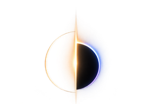

<p align="center">
  
</p>

<h1 align="center">RUDRA</h1>

<p align="center">
  <b>R</b>adiance <b>U</b>niversal <b>D</b>ynamic <b>R</b>ange <b>A</b>dapter<br>
  Turns 8-bit SDR footage into scene-linear HDR — and tells you where it did it.
</p>

<p align="center">
  
  
  
  
</p>

---

## What it does

An 8-bit frame throws away everything above the clip. RUDRA puts it back where
the SDR mapping was non-invertible — blown highlights, crushed shadows — and
leaves every other pixel to the analytic inverse, unchanged.

It ships as a desktop Studio and a delivery CLI.

---

## See it


Three held-out frames. Unknown tone curve, 4:2:0 chroma, banding, JPEG — the
condition real footage arrives in. The analytic inverse has a hard ceiling and
clips into it; the sky goes flat. RUDRA keeps the roll-off the reference has.
HDR columns are stopped down by whole stops so a browser can show them, and the
exposure comes from the reference alone, so nothing is flattered by its own
output.

---

## Install

```bash
git clone https://github.com/fxtdstudios/RUDRA.git
cd RUDRA
pip install -e .
```

Then open the Studio — it loads the shipped checkpoint and opens a browser tab:

```bash
python ui/server.py
```

Drop a frame or a shot, and **Master** writes a scene-linear OpenEXR. The CLI
takes it from there, with no GPU:

```bash
rudra info    master.exr --nits-scale 203                         # nits, percentiles
rudra deliver masters/ --output shot --target prores4444 --fps 24  # or hdr10, hlg
rudra aces    masters/ --output aces                               # ACES 2065-1 EXR
```

Batch inference without the Studio is `python training/infer_sdr2hdr.py`; its
output is a float TIFF, which the CLI does not read yet.

CUDA is optional — it runs on CPU, slower. `ffmpeg` is needed for video, not
for stills.

---

## The Studio


Drop a frame or a shot. The network runs once per frame on the GPU and hands
the page raw fields; everything after that composes on your own GPU, so the
controls move at frame rate.

| Layer | What it shows |
|---|---|
| **Compare** | RUDRA, the analytic baseline, or a draggable wipe between them |
| **False colour** | luminance zones in nits, against a diffuse white of 203 |
| **Difference** | how far RUDRA moved from the baseline — black means it changed nothing there |
| **Probe** | one pixel: baseline, RUDRA, the delta in stops, and whether the SDR clipped there at all |
| **Scopes** | waveform and histogram in nits, computed from the frame's own pixels |

Playback runs at the footage's frame rate, with a read-ahead in front of the
playhead. Master to OpenEXR in ACES 2065-1 or linear Rec.2020.

---

## Results

429 held-out frames, native 1280×720, scene-linear with diffuse white at 1.0.
Whole scenes are held out, so no scene appears on both sides of a split.

| Condition | Method | PU21-PSNR | CVVDP (JOD) |
|---|---|---:|---:|
| **hard** | analytic baseline | 25.92 | 7.362 |
| **hard** | **RUDRA + shadow gate** | **27.15** | **7.751** |
| clean | analytic baseline | 45.99 | 9.448 |
| clean | **RUDRA + shadow gate** | **46.06** | **9.561** |

`hard` is the deployment condition. `clean` is well-graded input, which the
analytic baseline already handles well. The gated configuration is the only one
we have scored that beats the baseline in **both** conditions on **both**
metrics.

> **Read both metrics together.** The ungated model gains +1.43 dB on degraded
> input and *loses* 3.0 dB on clean input — where CVVDP puts the same gap at
> −0.046 JOD, far below a just-noticeable difference. The two instruments
> disagree by two orders of magnitude on identical frames. Quoting the gain
> without the loss, or the clean PSNR without the JOD beside it, misrepresents
> the result in opposite directions.

Full tables, the failure analysis, and how to recompute every number:
[`docs/RESULTS.md`](docs/RESULTS.md).

---

## Documentation

| Document | What is in it |
|---|---|
| [`paper/main.pdf`](paper/main.pdf) | the measured write-up |
| [`docs/RESULTS.md`](docs/RESULTS.md) | every benchmark table, and how to recompute it |
| [`docs/TRAINING.md`](docs/TRAINING.md) | training on your own footage, end to end |
| [`docs/INTERNALS.md`](docs/INTERNALS.md) | the composite, the units, the gate |
| [`docs/CORPUS.md`](docs/CORPUS.md) | what a training set has to contain |
| [`docs/DEVELOPMENT.md`](docs/DEVELOPMENT.md) | repo layout, how it is checked, and the decisions behind it |
| [`STATUS.md`](STATUS.md) | what is finished and what is open |

---

## Licence

Code is Apache 2.0. **The weights are non-commercial** — the training corpus
is why, and that is not a term FXTD Studios can waive for you. See
[`checkpoints/LICENSE`](checkpoints/LICENSE) and [`NOTICE`](NOTICE).

---

<p align="center">
  <br>
  <b>FXTD Studios</b> · Cairo<br>
  <sub>A Radiance Studio technology · Light has a deeper story</sub>
</p>
