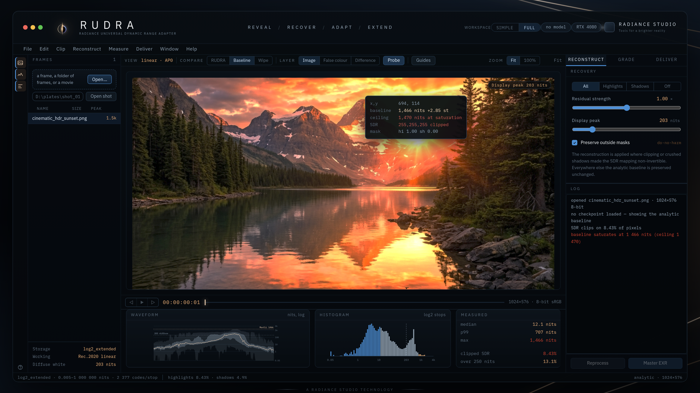
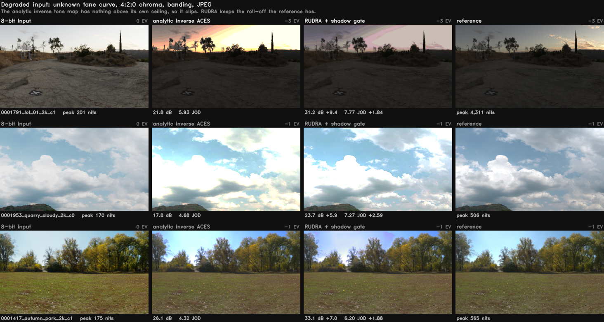
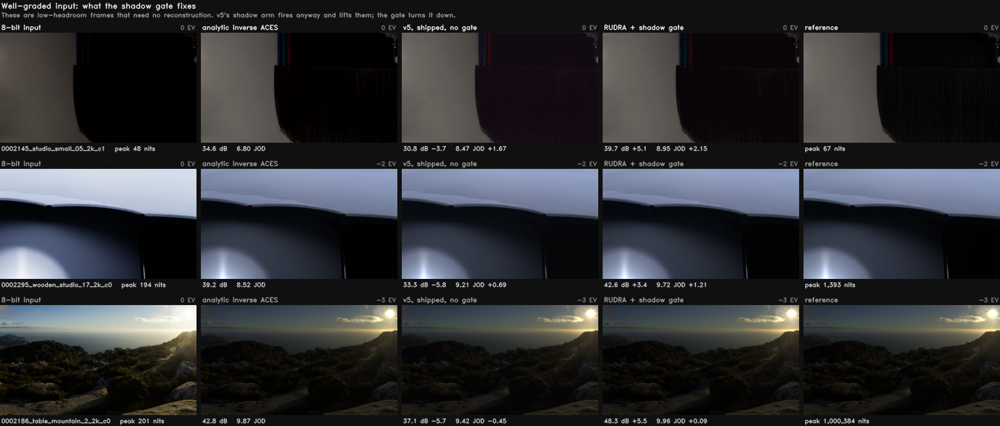
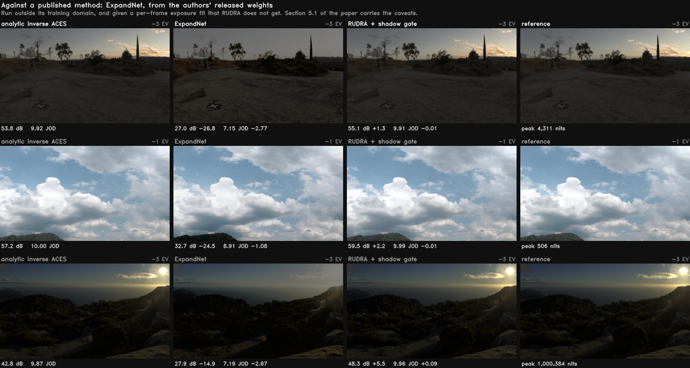

# RUDRA

**Radiometric Dynamic-Range Conditioning for HDR-Aware Diffusion Models**
[FXTD Studios](https://fxtdstudios.com) / Radiance Research

Diffusion models are trained on tone-mapped images, so they learn a world where
nothing is brighter than white. RUDRA gives them the rest of the range back. It
decodes latents straight to scene-linear HDR and conditions the backbone on a
radiometric descriptor, so luminance, exposure and wide-gamut colour survive
generation.

A second path needs no diffusion model at all. Hand it an ordinary 8-bit frame
and it reconstructs what the tone map threw away. Most of this README is about
that path, because it is the part we finished measuring.

Paper: [`paper/main.pdf`](paper/main.pdf), *What an 8-Bit Frame Can and Cannot
Say About the Scene Behind It*, 15 pages. The same file is mirrored at
[`research/RUDRA_HDR_2026.pdf`](research/RUDRA_HDR_2026.pdf).
Weights: [huggingface.co/fxtdstudios/RUDRA](https://huggingface.co/fxtdstudios/RUDRA/tree/main).

Three separate things share the name RUDRA, and [`STATUS.md`](STATUS.md) keeps
them apart. The production decoders are done. The research pipeline's Stage 3
was never trained. The SDR to HDR model is measured and written up, and it is
what most of this file is about.

---

## RUDRA Studio



Drop in a frame or a whole sequence. The network runs once per frame on the GPU
and hands the page its raw fields. Everything after that is composed on your own
GPU, so the controls move at frame rate instead of at one round trip each.

For a real plate, type its path into **Open shot** at the foot of the Frames
rail: a folder of frames, or a video file (`.mov`, `.mp4`, `.mxf`, `.mkv`,
`.avi`, `.m2ts`, `.webm`). Nothing is uploaded -- the server is on the same
machine as the footage and reads it where it sits, so a 1.4 GB ProRes never
crosses the socket and a 900-frame plate opens as fast as a 3-frame one. Frames
are decoded on demand as you scrub, so the shot opens now rather than in a
minute. Video needs `ffmpeg` on `PATH` (`winget install Gyan.FFmpeg`); a folder
of frames needs nothing. **Master EXR** works the same on an opened shot as on a
dropped file, and names the file after the frame.

Two ways to compare against the analytic inverse tone map:

| | how | best for |
|---|---|---|
| flip | hold **B**, or press and hold the image | judging whether a change is real |
| wipe | press **W**, drag to move the seam | showing someone where it is |

Region EV is a grade, not a preview. Drag a value to scrub it, double-click to
zero it. The bands are soft luminance qualifiers from
`rudra/delivery/controls.py`, and **Master EXR** applies the same qualifier and
gain to the file: full-resolution ACES 2065-1, AP0 primaries, ST 2065-4
chromaticities, and a sidecar recording how it was graded.

Waveform, histogram and every measured number follow the composite on screen.
MaxCLL and MaxFALL come from an exact GPU reduction, not a downsample. Press `?`
for the keyboard.

Double-click `run_studio.bat` on Windows, or run `./run_studio.sh` anywhere
else. The first run builds a virtual environment and installs what it needs;
after that it checks the install and goes straight to the server. Anything you
pass is handed to the server:

```bash
./run_studio.sh                                      # or run_studio.bat
./run_studio.sh --port 9000 --device cpu
./run_studio.sh --setup                              # force a reinstall
```

Set `RUDRA_PYTHON` to an interpreter you already have, a ComfyUI environment
for instance, and the launcher uses that instead of building a second one and
downloading another copy of torch. To skip the launcher:

```bash
python ui/server.py                                  # finds a checkpoint, opens a browser
python ui/server.py --checkpoint sdr2hdr_image_v6.pt # or any committed model by name
```

Without `--checkpoint` it looks for the newest model in your data directory,
then falls back to the one committed here, then to demo mode. `?frame=<url>`
loads a frame from the server; `?demo=1` loads the bundled sample, which is how
the screenshot above is made rather than staged.

Needs WebGL2 and float render targets. Any current browser will do.

---

## Install

Python 3.10 to 3.13. If you only want the viewer, clone and run
`run_studio.bat` or `./run_studio.sh` and skip the rest of this section: the
launcher does the install itself.

```bash
git clone https://github.com/fxtdstudios/RUDRA.git && cd RUDRA
pip install -e .                          # core plus the `rudra` CLI
pip install -e ".[metrics]"               # cvvdp and lpips, for the real metrics
pip install -e ".[test]" && pytest tests/
```

CUDA is only needed for training and inference. `rudra/delivery/` is torch-free,
so render and mastering machines need Python and numpy and nothing else.

Six checkpoints ship with the repo, 38 MB, so a fresh clone can reconstruct a
frame and reproduce the tables below without downloading anything:

```bash
sha256sum -c checkpoints/SHA256SUMS
```

`checkpoints/models.json` is the registry the server reads.
[checkpoints/README.md](checkpoints/README.md) says what each file is and how to
load one. Training pairs and HDR sources stay out of git.

### ComfyUI decoders

Download the decoder for your backbone into `ComfyUI/models/radiance/`, enable
`rudra_decoder` in the *Radiance HDR VAE Decode* node, pick a `decoder_size`.

```bash
huggingface-cli download fxtdstudios/RUDRA --include "rudra_*_decoder_*.safetensors" \
    --local-dir "ComfyUI/models/radiance"
```

| backbone | VAE latent | recommended | PSNR_log |
|---|---|---|---:|
| Flux.1 | 16ch / 8x | full | 29.77 |
| Wan | 16ch / 8x | full | 32.45 |
| LTX | 128ch / 8x | full | 25.47 |
| SDXL | 4ch / 8x | turbo | 33.86 |
| Qwen-Image | 16ch / 8x | turbo | 26.67 |
| Flux.2 Klein | 128ch / 16x | turbo | 28.57 |

---

## Use it

Reconstruct a frame or a sequence:

```bash
python training/infer_sdr2hdr.py input/ --output-dir out/ \
    --checkpoint checkpoints/sdr2hdr_shadow_v1.pt
```

Master and deliver. No GPU required:

```bash
rudra info out/ --nits-scale 203                                           # nits, PQ codes, percentiles
rudra metadata out/ --nits-scale 203 --output out/master --peak-nits 1000  # DoVi L1 + HDR10+
rudra aces out/ --output delivery/aces --ocio                              # ACES EXR + OCIO
rudra grade in.exr --output graded/ --region 400:2000:1.0:0.5              # +1 EV, 400-2000 nits
rudra bench bench_root/ --output results.json                              # PU21-PSNR / CVVDP
```

Train it on your own footage: [**Train on your own footage**](#train-on-your-own-footage).


---

## Results

All numbers below come from the same 429 held-out frames at native 1280x720,
scene-linear with diffuse white at 1.0, scored at `--nits-scale 203`. Two
metrics against the same unclamped reference: PU21-PSNR and ColorVideoVDP JOD.
Whole scenes are held out, so no scene appears on both sides of a split.

`hard` is the deployment condition: unknown tone curve, 4:2:0 chroma, banding,
JPEG. `clean` is well-graded input, which the analytic inverse-ACES baseline
already handles well.



Three held-out frames under the degraded condition. The HDR columns are stopped
down by whole stops so the highlight range lands where a browser can show it,
and the exposure is picked from the reference alone, so no method is flattered
by its own output. The analytic inverse tone map has a hard ceiling and clips
into it; the sky is a flat plate. RUDRA keeps the roll-off the reference has.
Per-frame numbers under each panel come from the benchmark's own result files.

| Condition | Method | PU21-PSNR (dB) | CVVDP (JOD) |
|---|---|---:|---:|
| clean | analytic baseline | 45.99 | 9.448 |
| clean | v5, as shipped | 42.99 | 9.402 |
| clean | v6, 4x capacity | 43.24 | 9.452 |
| clean | v5, shadow arm off | 46.50 | 9.431 |
| clean | v5 + shadow gate | 46.06 | 9.561 |
| hard | analytic baseline | 25.92 | 7.362 |
| hard | v5, as shipped | 27.34 | 7.805 |
| hard | v6 | 26.88 | 7.706 |
| hard | v5, shadow arm off | 26.25 | 7.497 |
| hard | v5 + shadow gate | 27.15 | 7.751 |

The gate row is the one that matters. It is the only configuration we have
scored that beats the analytic baseline in both conditions on both metrics.

### The two metrics disagree

On degraded input v5 earns its keep: +1.43 dB and +0.44 JOD over the baseline,
winning 348 of 429 frames. That is the deployment condition and it is what the
project is for.

On clean input the same model loses 3.0 dB of PU21-PSNR and wins only 115
frames. CVVDP puts the same gap at -0.046 JOD, far below a just-noticeable
difference. The two instruments are two orders of magnitude apart on identical
frames. What RUDRA adds to well-graded input is highlight energy that PU21-PSNR
punishes and no viewer sees.

Do not report the clean PSNR row without the JOD beside it.

### The failure mode is in the shadows

Split the clean frames by how much headroom the ground truth has and the
regression stops looking diffuse.

| clean frames | mean delta vs baseline | median ground-truth peak |
|---|---:|---:|
| 60 worst | -10.76 dB | 238 nits |
| 60 best | +3.41 dB | 19,590 nits |

Correlation between `log2(peak_nits)` and gain is +0.46. The per-pixel luminance
gate never sees the frame as a whole, so it cannot tell a 238-nit studio
interior from a 20,000-nit sunset.

We guessed twice at the cause and were wrong twice. It is not invented
highlights: at the worst 1% of pixels the true luminance has a median of 4 nits
against 21 frame-wide, and only 46% of them are over-predicted. It is not a tail
either: discarding the worst 10% of pixels closes 2.3 dB of the 5.55 dB gap and
leaves 3.2 behind.

The damage comes from the shadow arm of the gate firing on low-dynamic-range
content that needs no reconstruction. Ablating that arm recovers the whole clean
deficit and gives up most of the hard gain, which is what pointed at the fix.

### One number per frame would fix it, and the input does not carry it

Give the residual a single global scale alpha and let an oracle pick it per
frame. The ceiling is large: +5.84 dB on clean and +0.29 dB on hard at the same
time. No constant reaches it. Clean wants alpha near 0.125, hard wants near 1.1,
and the constant that fixes clean throws away 85% of the hard gain.

So we tried to learn it. On 51 held-out frames, each clean and degraded,
cross-validated by frame:

| knowing | MAE on oracle alpha | R2 |
|---|---:|---:|
| nothing (predict the mean) | 0.501 | 0.000 |
| the features, via a linear readout | 0.487 | +0.031 |
| the condition, perfectly | 0.409 | +0.213 |
| the oracle itself | 0.000 | 1.000 |

The features explain 3% of the target's variance. 79% of that variance sits
within a condition rather than between conditions, so a perfect
clean-versus-degraded classifier caps out at R2 0.213. That is everything a
condition stem could ever buy. The remaining 79% asks whether this frame's
clipped region was a 200-nit lamp or a 20,000-nit sun, and an 8-bit frame does
not carry the evidence.

This is the information limit of single-image inverse tone mapping, measured
rather than asserted. Capacity (4x), corpus (6x) and objective were each varied
and none of them moved it.

### The gate that did work

The bound applies to the question, not to the problem. Asked for a continuous
scale, the input cannot answer. Asked "did this frame arrive clean or
degraded?", it can. That is the one axis that is detectable, and the
shadow-arm ablation showed it is the axis that matters. The target also needs no
oracle: at training time we know whether we degraded the frame.

`ShadowGate` is 21,121 parameters on the frozen v5 backbone. It predicts one
weight per frame on the shadow prior, supervised by binary cross-entropy against
the degradation label. Weight 1.0 reproduces `recovery_mode="all"` exactly and
0.0 reproduces `recovery_mode="highlights"` exactly, so it interpolates between
the two ablation endpoints and nothing else.



Three low-headroom frames that need no reconstruction at all. The shipped v5
lifts them anyway, which is the shadow arm firing where it should not: a purple
cast in the black curtain, haze on the dark wall, milk in the foreground rocks.
The gate turns that arm down and lands on the reference.

Three seeds, gain over the analytic baseline:

| seed | clean dB | clean JOD | hard dB | hard JOD | clean CVVDP | clean frames won |
|---|---:|---:|---:|---:|---:|---:|
| 20260901 | +0.07 | +0.113 | +1.24 | +0.389 | 9.561 | 251 / 429 (59%) |
| 2 | +0.71 | +0.068 | +0.96 | +0.308 | 9.516 | 315 / 429 (73%) |
| 3 | +0.45 | +0.089 | +1.18 | +0.358 | 9.537 | 280 / 429 (65%) |
| mean +/- sd | +0.41 +/- 0.33 | +0.090 +/- 0.023 | +1.12 +/- 0.15 | +0.352 +/- 0.041 | | |

The shipped v5 wins 115 of 429 clean frames for comparison. All three runs are
positive on all four measures, and all three land a clean CVVDP above every
fixed alternative, including both ends of the ablation they interpolate between.
A hard binary switch could not do that. The gate emits intermediate weights and
finds per-frame settings that neither extreme reaches.

Against the shipped model that is +3.41 +/- 0.32 dB and +0.135 +/- 0.023 JOD on
clean, for 0.30 +/- 0.15 dB and 0.091 +/- 0.041 JOD on hard.

Seed 20260901 is the one committed here. It is also the worst of the three on
clean PU21 and the best on clean CVVDP, so reporting it alone understates the dB
result sixfold and overstates the JOD by a quarter. Three seeds support the
claim that the sign is stable. They do not support a confidence interval.

### One thing we tested and dropped

On 3 September two photographs were run through the shipped model, a stock
sunset and an Iceland landscape, neither in any split. Both suggested something
the luminance account cannot see: in the brightest 1% of pixels the red share of
R+G+B fell by about 0.07 while green rose by about 0.05. A hue rotation at
roughly constant luminance is nearly invisible to PU21-PSNR and to CVVDP as we
report them, so a real one would be a defect our own metrics would miss.

Measured on all 429 held-out frames against the reference, which the photographs
do not have, it does not survive:

| band | share of pixels | green shift | vs the reference | frames agreeing on sign |
|---|---:|---:|---|---:|
| < 20 nits | 41.2% | +0.005 | towards | 33% |
| 20-203 | 46.1% | +0.000 | - | 32% |
| 203-1000 | 11.4% | -0.001 | towards | 64% |
| > 1000 | 1.3% | +0.005 | away (0.0057 -> 0.0110) | 50% |

Only the top band moves away from the truth. The shift there is ten times
smaller than on the photographs, it covers 1.3% of pixels, and 50% sign
agreement across frames is a coin flip. Both photographs were saturated sunsets
whose highlights are nearly one hue, so a small per-channel error rotates them
coherently. The split's bright band averages near-neutral and per-frame
rotations cancel out. The effect is real on single-hue highlights and is not a
property of the model, so it is not in the paper.

It is recorded here because quietly dropping a hypothesis that did not work out
is how a repository ends up looking more certain than its evidence.
`training/analyze_chroma_shift.py` reproduces the table and
`docs/chroma_shift_shadow_v1.json` holds the raw sums.

### What we got wrong along the way

Five of the expensive mistakes this cycle were measurement defects rather than
model defects. Most are in the paper, because each one silently corrupted a
result we believed, and each is a mistake any comparable pipeline can make.

**Selection on the maximum of a noisy series.** `best.pt` was chosen by the
maximum of `composite_gain` over 102 evaluations, where `clean_gain_db` had mean
-1.43 dB and sd 1.29, and only 10 of 102 evals were ever positive. The shipped
checkpoint's +0.02 ranked 9th of 102. Selection now uses a trailing median over
five evals. Replayed, it picks step 72,000 instead of 81,000, which we then
scored. It is better on the criterion the selector optimises (composite -1.36
against -1.57) and worse on CVVDP in both conditions. Smoothing a selector does
not fix selecting on the wrong quantity.

**An evaluation that read the front of the split.** `DataLoader(val,
shuffle=False)` with `max_batches=N` reads the alphabetically first N records.
One run's eval was 32 records over 11 scenes, every name between
`abandoned_factory` and `blau_river`, leaving 403 records and 87 scenes
unmeasured. Since error correlates with headroom, that slice reported
`clean_gain +0.61` where the benchmark measured -3.0.

**A viewer that presented every frame upside down.** The default framebuffer
puts row 0 at the bottom and the display shader sampled `vUV` unchanged. No
numeric test caught it, because they all compare the float composite, which a
presentation flip leaves untouched. The one test that read the canvas did so
through `readPixels`, which returns rows bottom-first and cancelled the flip
against itself. Master EXR output was never affected. There is now a test that
looks at pixels.

**Two numbers transcribed and never checked back.** The paper said 346 frames
won on degraded input where the benchmark says 348, and gave v6 4,772,485
parameters where the checkpoint has 4,770,117. Both are small, and neither was
ever compared against its source. `training/audit_paper_numbers.py` now
recomputes every derived claim from `bench/results/*.json`, and
`tests/test_committed_checkpoint_2026_09_03.py` counts the tensors in every
committed model against what the registry and the paper claim. Both fail loudly.

**Reporting one seed as if it were the method.** The gate first shipped on seed
20260901 alone. It turned out to be the worst of three on clean PU21 and the
best on clean CVVDP, so the single-seed report understated one result sixfold
and overstated the other by a quarter. It had been selected on validation
accuracy, and nobody had checked what that accuracy tracked. The paper now
reports mean and spread everywhere.

---

## The paper

[**`paper/main.pdf`**](paper/main.pdf) is the write-up of the SDR to HDR model:
15 pages, 11 sections, three figures, every number traceable to a command. The
PDF is committed, and so is the LaTeX it is built from, so a clone with no
LaTeX toolchain still has the document and a clone with one can rebuild it.

```bash
bash paper/build.sh      # -> paper/main.pdf
bash paper/mkarxiv.sh    # -> paper/rudra-arxiv.tar.gz, verified to build flat
```

`paper/main.tex` is the entry point. `paper/_body.tex` and `paper/_abstract.tex`
are generated, so do not edit them by hand. `paper/ABSTRACT_ARXIV.txt` is a
trimmed abstract for the submission form, which caps at 1,920 characters where
the PDF's abstract runs longer.

Every derived number in sections 5, 6 and 6.1 to 6.2 can be recomputed on
demand by two scripts that exit non-zero on any drift: 58 claims from the
benchmark files and five more from the headroom join. Commands are below.

Two limits the paper states and this README should repeat. One published method
has been scored on our split, so the numbers above are against our own analytic
baseline and against ExpandNet; three other public methods have runnable code
and have not been run. Section 6's trimmed-PSNR table and section 7's oracle
sweep have no script yet, because they need per-pixel statistics over the
reference frames rather than the per-frame results the benchmark writes.
Section 10 says so rather than leaving a reader to assume otherwise.

### Reproducing the numbers

```bash
powershell -ExecutionPolicy Bypass -File training\run_bench.ps1    # four exports, six scorings
python training/audit_paper_numbers.py --bench <bench dir>         # 58 claims, exits 1 on drift
python training/analyze_headroom.py --bench <dir> --manifest <m> --check   # section 6's split
python training/analyze_chroma_shift.py --bench <dir>/clean               # colour, per band
```

`run_bench.ps1` skips any stage whose output already exists, so an interrupted
run resumes. `score_checkpoint.ps1 -Checkpoint <ckpt> -Name <label>` adds one
model to an existing benchmark instead of redoing the reference, which is the
expensive half.

### Comparing against published work

ExpandNet, run from the authors' released weights on the same 429 frames:

| clean, 429 frames | PU21 dB | CVVDP JOD |
|---|---:|---:|
| RUDRA + gate, as deployed | 46.06 | 9.561 |
| analytic inverse-ACES baseline | 45.99 | 9.448 |
| ExpandNet | 27.50 | 7.532 |

That is -18.56 dB and -2.029 JOD, winning 1 of 429 frames on PU21 and 16 on
CVVDP.

Both metrics agree here, which is worth noting beside the disagreement above:
the two-order-of-magnitude gap is a property of small differences on well-graded
input, not a defect in either instrument.



ExpandNet loses the sun in the third frame outright and flattens the highlight
range in the other two. It is also the only column here that got a per-frame
exposure fit.

Three caveats live in section 5.1 of the paper and should travel with the
number. ExpandNet is run outside its training domain. Our reference is unclamped
to about a million nits. And it needs a per-frame exposure fit spanning 35.5x
where RUDRA needs 1.0x, because RUDRA predicts absolute nits and ExpandNet
predicts relative radiance. Given the best possible exposure it recovers only
+0.39 dB, so the fit is not what costs it.

Santos 2020, HDRCNN and SingleHDR have public code and no runner yet. The
harness that made this one work:

```bash
git clone https://github.com/dmarnerides/hdr-expandnet.git
python training/export_bench_pairs.py ... --write-sdr        # -> <out>/sdr/**.png
python training/run_expandnet.py --sdr <out>/sdr --repo hdr-expandnet \
    --out <out>/expandnet_raw
python training/import_method_output.py --out <dir> --from <out>/expandnet_raw \
    --name expandnet
rudra bench <dir> --nits-scale 203 --test-dir expandnet
```

Published single-image iTMO methods predict relative radiance with no nit
anchor, so the importer fits one global scalar per frame on the pixels the SDR
input did not clip. That is a free parameter RUDRA does not get, since it
predicts absolute nits and is scored as it stands. Run the importer on RUDRA's
own tree as well and report the symmetric row, or the table flatters us for
free. `import_<name>.json` records the fitted scales, any frames resized, and
any the method dropped.

---

## Train on your own footage

RUDRA is meant to be retrained. A model fitted to your cameras, your grades and
your delivery ceilings will beat a general one on your material, and the data
never leaves your machine. Nothing here phones home.

Training on footage you own also sidesteps the licence on the released weights
entirely — see [Licence](#licence). Your model, your data, your terms.

### What you need

**HDR ground truth. This is not optional.** RUDRA learns to invert a tone map,
so it needs to see the answer. The SDR half of every pair is *generated* from
your HDR by the pipeline — you do not supply it, and you cannot train from SDR
alone. If all you have is SDR, there is nothing here to learn from.

Anything with real range works:

| You have | Works | Note |
|---|---|---|
| Scene-referred EXR / Radiance HDR | best | no grade ceiling, the model sees true radiance |
| Graded HDR masters (PQ / HLG) | yes | declare the ceiling, see below |
| HDR video (MXF, MOV, ProRes, MP4…) | yes | frames are extracted; `--video-stride` thins them |
| Log footage (S-Log, V-Log, LogC) | yes, via EXR | convert to scene-linear first, in Resolve or Nuke |
| 8-bit SDR only | **no** | no target to learn |

Formats the scanner accepts: `.exr .hdr .tif .tiff .dpx .png .jxl .avif .heic`
and `.mxf .mov .mp4 .mkv .avi .m2ts .ts .webm`.

**How much.** The shipped model saw ~28,500 records. Scene *diversity* matters
far more than frame count — 926 clips drawn from 11 scenes is 11 scenes, and
the model will overfit to them no matter how many crops you cut. As a rough
floor: 20+ distinct scenes and a few thousand records before the numbers mean
anything. Below that you are measuring your test split.

**Your grade ceiling matters.** If your masters are graded to 1,000 or 4,000
nits, every pixel sitting exactly at the ceiling means *at least* that bright,
not *exactly* that bright. The loss goes one-sided there with three stops of
free headroom. Without it the model learns to cap, and your highlights die.
`scan_sources.py` probes for this, but check its output against what you know
about your deliverables.

### One command

```bash
./train.sh /path/to/your_hdr_footage         # macOS / Linux
train.bat  D:\path\to\your_hdr_footage       # Windows, or double-click it
```

That is the whole thing. It checks your environment, inventories the footage,
builds the pairs, splits them by scene, verifies the corpus, trains the
backbone, trains the shadow gate on top, and scores the result against the
analytic baseline on your own held-out frames. It installs the requirements the
first time if they are missing.

It is **resumable**: a stage whose output already exists is skipped with a
note, and interrupting the backbone and re-running picks up from its last
checkpoint. Nothing is lost by stopping it.

```bash
python training/train_from_footage.py FOOTAGE --dry-run   # print the plan, run nothing
python training/train_from_footage.py FOOTAGE --from pairs # redo from a stage
python training/train_from_footage.py FOOTAGE --steps 40000 --device cpu
```

It stops early rather than late. Pointed at 8-bit SDR it says there is nothing
to learn from, instead of training a model that has learned the identity
function. Pointed at 200 files it warns that you will be measuring your test
split. If the corpus fails verification it stops there and tells you the checks
exist because something got past them once.

### The five commands underneath

Run these directly when you want something the driver's defaults do not give.
Each stage checks its own output and refuses to hand work forward if the check
fails.

```bash
# 1. Inventory. What is on disk, what range it carries, how it is encoded.
python pipeline/scan_sources.py /path/to/your_hdr --out work/inventory.jsonl

# 2. Pairs. Generates the SDR side, encodes the HDR side, writes the sentinel.
python pipeline/prepare_pairs.py --inventory work/inventory.jsonl --dst work/pairs \
    --mode log2_extended --crops 3 --crop-size 512 --video-stride 2

# 3. Manifests. Scene-held-out splits, not frame-held-out.
python pipeline/build_manifests.py --pairs-dir work/pairs --out-dir work \
    --val-frac 0.10 --test-frac 0.10

# 4. Verify. Run this. It is the cheapest hour you will spend.
python pipeline/verify_dataset.py --pairs-dir work/pairs \
    --manifest work/sdr_hdr_manifest.jsonl \
    --video-manifest work/video_manifest_9f.jsonl

# 5. Train the backbone.
python training/train_sdr2hdr.py --mode image --manifest work/sdr_hdr_manifest.jsonl \
    --output-dir work/checkpoints/image --steps 100000 \
    --best-metric composite_gain --device cuda
```

Then the shadow gate, on the frozen backbone. Fifteen minutes on one 4080, and
it is what takes the model from helping only on degraded input to helping on
both conditions:

```bash
python training/train_shadow_gate.py --manifest work/sdr_hdr_manifest.jsonl \
    --init-checkpoint work/checkpoints/image/best.pt \
    --output-dir work/checkpoints/shadow --seed 20260901
```

The backbone is the long stage — the shipped model is step 81,000. Everything
after it is minutes.

### Reading the log

Every eval scores two conditions, and the distinction is the whole point:

- `clean_*` — the held-out frame as prepared. A well-graded plate.
- `hard_*` — the same frame under a seeded camera and codec degradation.

**Only the hard numbers describe deployment, and only they choose `best.pt`.**
A model that wins on clean and loses on hard is a model that will disappoint
the first time an artist points it at real archive material.

Both report `gain_db` against the analytic inverse tone map the network sits on
top of, so "better than doing nothing" is a number rather than an impression.
A gain near zero on hard means the network is not earning its inference cost.

### Check it against the shipped model

Same held-out frames, same metrics, both models:

```bash
python training/export_bench_pairs.py --checkpoint work/checkpoints/shadow/best.pt \
    --manifest work/sdr_hdr_manifest.jsonl --out bench/hard \
    --condition hard --test-name mine
rudra bench bench/hard --output results.json
```

PU21-PSNR and ColorVideoVDP JOD, against the same unclamped reference. Read the
JOD. [The two metrics disagree](#the-two-metrics-disagree) by two orders of
magnitude on small differences, and the JOD is the one calibrated against human
observers.

### Deploy it

Point the viewer and the CLI at your checkpoints:

```bash
export RUDRA_CHECKPOINT_ROOTS=/path/to/work/checkpoints    # or set on Windows
```

That root is searched before this repo's `checkpoints/`, so your model wins
without touching the repo. To have it appear by name in the Studio picker, add
an entry to `models.json` beside the checkpoint — `file`, `kind: sdr2hdr`,
`title`, and a `note` saying what it is and what it measured. The registry
exists because discovery-by-newest-file once picked a temporal refiner and tried
to load it as an image model.

### Six ways to waste a week

Every one of these cost us real time. They are in the checks now, but the
checks only help if you read what they say.

1. **Mixing storage conventions.** `_ingest_config.json` beside your pairs is
   the sentinel that says how the 16-bit HDR PNGs decode. Append pairs written
   under a different `--mode` or `--ceiling-nits` and the corpus becomes
   unreadable in a way that still trains. The pipeline refuses to mix them;
   use a fresh `--dst` rather than arguing with it.
2. **Two different meanings of 1.0.** The network's output is `1.0 = 10,000
   nits`. Storage and EXR are `1.0 = diffuse white = 203 nits`. Conflating them
   is a 5.6-stop error that produces entirely plausible-looking numbers — ours
   read 11.53 dB where the truth was 46.
3. **Not declaring the grade ceiling.** See above. The model learns to cap.
4. **Frame-held-out splits.** Two crops of one frame on both sides of a split
   is leakage, and it makes a model look far better than it is. Scenes are held
   out here, and `verify_dataset.py` enforces a cap on how much of the eval set
   any one scene may be.
5. **Reporting one seed.** The shipped gate first looked like a large win on
   seed 1 and a small one on seeds 2 and 3. Train three, report the spread.
6. **Judging on clean.** RUDRA is near-neutral on well-graded input by design —
   there is nothing to recover. Optimising the clean number optimises for the
   case that did not need you.

---

## Training data

The released model was trained on public HDR footage plus proprietary FXTD
material. None of it is committed here. `pipeline/scan_sources.py` reads
whatever you point it at.

| Source | What it gives | Grade ceiling | Licence |
|---|---|---|---|
| [Poly Haven HDRIs](https://polyhaven.com/hdris) | 963 scene-referred panoramas, real suns above 100,000 nits | none, scene-referred | [CC0](https://polyhaven.com/license) |
| [HdM-HDR-2014](https://hdm-stuttgart.de/vmlab/hdm-hdr-2014/) | 9 cinematic scenes: fireworks, forge sparks, fire, stage lights | 4,000 nits, Rec.2020 | free for academic use; commercial needs a licence from HdM |
| HdM-HFR-2017 | Bar and Fire scenes, 192 fps, same FTP host | 1,000 nits (PQ-1K) | as above |
| [Netflix Chimera](https://opencontent.netflix.com/) | 4K live action, P3-PQ | 10,000 nits | [CC BY 4.0](http://download.opencontent.netflix.com/) |

Both HdM sets come off the same plain-FTP host, `hdr-2014.hdm-stuttgart.de`
(user `HdM-HDR-2014`). `pipeline/fetch_stuttgart.py` handles the download and
resumes if it drops:

```bash
python pipeline/fetch_stuttgart.py --list-root
python pipeline/fetch_stuttgart.py --root HdM-HDR-2014_Color-Graded-for-HDR \
    --dest /path/to/source_hdr/Stuttgart_HDR_2014 --only carousel_fireworks fireplace
```

The grade ceilings in that table matter. Three of the four sources stop at a
hard delivery ceiling, which is why the loss treats those pixels as censored.

Three things that make a training log readable:

- Every eval scores two conditions. `clean_*` is the held-out frame as prepared.
  `hard_*` is the same frame under a seeded camera and codec degradation. Only
  the hard numbers describe deployment, so only they choose `best.pt`.
- Both report `gain_db` against the analytic inverse tone map the network sits
  on top of, so "better than doing nothing" is a number rather than a guess.
- Graded sources are censored. A pixel at exactly 4,000 nits in a 4,000-nit
  grade means at least 4,000, so the loss goes one-sided there with three stops
  of free headroom above the ceiling. Otherwise the model learns to cap. The
  temporal refiner did not do this until 28 August 2026, on a video corpus where
  84% of clips carry a hard ceiling. It would have undone the image model's
  highlights frame by frame.

### Video is a different problem

There are 935 clips but only 13 scenes, split 11 train / 1 val / 1 test. A
number measured on one held-out scene describes that scene, so the temporal
refiner is reported as unevaluated rather than given a figure. More clips would
not help: 926 training clips from 11 scenes is 11 scenes sliced 84 ways.

`pipeline/render_hdri_moves.py` is the way out. It flies a virtual camera
through the 963 scene-referred Poly Haven panoramas (pans, tilts, rolls and slow
zooms) and writes SDR/HDR clip pairs with exact ground truth, because both
halves come from the same radiance. Frames are named for
`build_video_manifest.py`, so the output drops into the existing pipeline:

```bash
python pipeline/render_hdri_moves.py --hdri-dir <polyhaven> --dst work/pairs_moves
python training/build_video_manifest.py --hdr-dir work/pairs_moves/hdr \
    --sdr-dir work/pairs_moves/sdr --output work/video_manifest_moves.jsonl \
    --clip-length 9 --frame-step 1
```

Two limits worth knowing. A panorama has no parallax, so nothing occludes
anything as the camera turns and nothing in the scene moves. That covers a large
share of real plates and none of the hardest ones. And the 2k panoramas are
2048x1024, so a 75 degree field of view samples 427 source pixels across a
1280-wide frame. `--max-upscale` refuses that by default instead of quietly
training on softened sources. Fetch the 4k or 8k versions, same licence, for
anything you intend to report.

One distribution shift is worth knowing before reading any clean number. The
band where the model fails, below 400 nits, is 45.2% of the test split and 27.2%
of what the sampler actually draws. Weighted median peak is 1,713 nits in train
against 546 in test. We did not design that and a reader should weigh it.

---

## Layout

```
rudra/            Descriptor, DRE transformer, cross-attention, FiLM decoder,
                  DR-gated LoRA, losses, CVVDP metric, and sdr2hdr.py
rudra/delivery/   Torch-free: DoVi L1 / HDR10+, ACES / EXR / OCIO, grade
                  controls, benchmarks, the `rudra` CLI
pipeline/         Corpus construction and its gates: scanner, pair preparation,
                  HDR storage (hdr_io), manifests, verify_dataset, and the
                  HDRI camera-move renderer that makes a video split possible
training/         Trainers, evaluation, inference, the exporter that turns a
                  checkpoint into benchmark pairs, run_bench.ps1, the ExpandNet
                  runner and third-party importer, and the scripts that
                  recompute and probe the paper's numbers
ui/               RUDRA Studio: the page, its GPU compositor, the inference
                  server behind them, and sequence.py, which opens a folder
                  of frames or a video by path
run_studio.bat    One-file launchers: set up on the first run, check and start
run_studio.sh     on every run after that
paper/            LaTeX source and the built PDF; build.sh and mkarxiv.sh
docs/             Paper figures, the Studio screenshot, the comparison strips
                  and make_compare.py, which rebuilds them from a scored bench
checkpoints/      Every SDR to HDR model, plus models.json, the registry the
                  viewer reads (see its README)
config/, configs/ VAE registry and training recipes
tests/            Curve round-trips, corpus guards, delivery, target decode,
                  censored highlights, GPU/torch composite parity, canvas
                  orientation, and a smoke test that presses every control
```

## How it is checked

The composite lives in three languages: torch in `rudra/sdr2hdr.py`, GLSL in
`ui/compositor.js`, numpy in `tests/compose_reference.py`. The numpy one is the
reference the other two are measured against, so the picture on screen and the
EXR that Master writes cannot drift apart.

| Check | Result |
|---|---|
| Shader vs reference, 11 cases incl. shadow weight 0.0-1.0 | 8.4e-6 relative |
| Wipe: which side is which, and does the seam move | baseline 49, RUDRA 255 |
| Torch vs reference, untiled | 3e-6 relative |
| Torch vs reference, tiled (overlap bands only) | up to a few % |
| MaxCLL, page vs the EXR it writes | 0.023% apart |
| Every control on the page, pressed | 54 checks, 0 failed |

```bash
pytest tests/                                  # everything
python tests/webgl_parity/parity.py            # shader vs the reference
python tests/webgl_parity/orientation.py       # the canvas itself, not a buffer
python tests/webgl_parity/wipe.py              # the wipe, also from pixels
python ui/server.py --port 8100 --no-browser --preload --device cpu
python tests/ui_smoke/press_everything.py --url http://127.0.0.1:8100/
```

The shader checks run headless on software GL, so they need no GPU and no torch.
The page is pressed rather than read, because a menu item that runs nothing
looks exactly like one that works.

All of this runs on every push. `.github/workflows/tests.yml` has two jobs: the
suite on Python 3.10 and 3.13 against CPU torch, with a flake8 pass for syntax
errors and undefined names, and the three shader checks against a real WebGL2
context on SwiftShader. Neither needs a GPU. The whole thing is about a minute.

Tiling is the one place the two compositions genuinely disagree, because
feathering fields and feathering composed predictions are not the same operation
either side of `expm1`. The viewer and Master both ask for an untiled pass, fall
back to tiles only on OOM, and report which they used.

The screenshot at the top of this file is generated against a running Studio and
refuses to overwrite itself with anything under 200 KB, which is the size of an
error page:

```bash
python ui/capture_shot.py
```

The comparison strips under `docs/compare/` are generated the same way, from a
scored benchmark rather than from a screenshot. Every caption in them is read
back out of the benchmark's own result JSON, so a strip cannot claim a gain the
benchmark does not have, and the display exposure is picked from the reference
alone rather than from any method's output:

```bash
python docs/make_compare.py --bench <bench dir>
python docs/make_compare.py --bench <bench dir> \
    --list-candidates hard baseline shadow_v1 20    # how the frames were picked
```

Every script has `--help` and a docstring saying what it does and why.
`pipeline/verify_dataset.py` lists the nine corpus invariants.
`pipeline/hdr_io.py` is the single source of truth for how targets are stored.

---

## Notes

Six checkpoints are committed, 38 MB in total: the shipped model, its two other
seeds, the v5 backbone, the v6 capacity ablation, and the temporal refiner. The
first five are what the Results tables are made of. Training pairs and HDR
sources stay out. Generate them with the scripts above, or pull the diffusion
decoders from
[HuggingFace](https://huggingface.co/fxtdstudios/RUDRA/tree/main).

The production decoders need no text conditioning. Stages 2 and 3 follow the
original paper and target SDXL's U-Net cross-attention; porting them to Flux is
the section 10 generalization experiment. Stage 3 has never been trained.
[`STATUS.md`](STATUS.md) says which lines of work are finished and which are
not.

The temporal refiner exists and is not evaluated here. Its held-out set is 4
validation and 5 test clips of one scene each, which is too small to report.

No temporal model was trained beyond it, and that is a measurement rather than
a plan that ran out of time. `training/gate_temporal_oracle.py` asks what a
*perfectly* aligned temporal model could win before one is built — exact
correspondence from the renderer's camera poses, omniscient per-pixel
selection among the aligned neighbours. On 40 rendered camera-move clips under
a real H.264 round trip it comes back at **+0.03 JOD achievable against a +0.5
threshold**, with the unreachable bound itself at +0.17.

The reason is in the corpus rather than in video. Those clips are pure camera
rotations through a static panorama, tone mapped with one fixed curve, so a
scene point carries the same 8-bit code in every frame it appears in and a
neighbour has nothing to add. Rendering fifty panoramas **twice** — identical
camera paths, identical compression, the SDR exposure the only difference —
separates the two claims:

| exposure | achievable (3 seeds) | ceiling |
| --- | --- | --- |
| constant | +0.110, +0.035, +0.046 JOD | +0.26 JOD / +0.63 dB |
| ±0.48 stops | **+0.511, +0.603, +0.661 JOD** | +1.03 JOD / **+4.55 dB** |

Every drifted arm clears the +0.5 threshold; every fixed-exposure arm is an
order of magnitude below it. So the information a temporal model would fetch
is *exposure variation* — present when the exposure moved between neighbours,
close to absent when it did not.

That is measured with the camera angles the renderer wrote down, and a plate
has none. Re-scoring the same clips with the correspondence **estimated** from
the pixels — what a deployed model actually holds — is what closed the line:

| alignment | achievable | oracle ceiling |
| --- | --- | --- |
| exact poses | +0.603 JOD | +1.090 JOD |
| RAFT optical flow | **+0.341 JOD** | +0.671 JOD |
| DIS optical flow | −0.069 JOD | +0.122 JOD |

The threshold was +0.5, fixed before any of it was measured. A learned
estimator recovers 57% of what exact poses give and still misses. One
combiner was declared and tried — weighting each neighbour by its
forward-backward residual instead of averaging equally — and moved the number
by 0.001.

The reason is worth carrying away from this project. The flow is *accurate*:
0.04–0.09 px median against the analytic poses. It fails in flat regions, and
forward-backward consistency cannot detect that failure, because any
displacement round-trips perfectly through a constant area. **The bad matches
are not low-confidence — they are confident and wrong**, in exactly the blown
sky a temporal model would be asked to reconstruct.

So RUDRA is a per-frame model by measurement, not for want of trying. No
temporal model was trained because there is nothing measurable for one to
learn. [`STATUS.md`](STATUS.md) carries the full tables and what would have to
be true of a corpus to reopen the question.

The viewer looks for a model in `RUDRA_CHECKPOINT_ROOTS` first, then in this
repo's `checkpoints/`, so a clone with nothing else still starts on a real
model. Point it at your own training output to have the newest run there win:

```bash
export RUDRA_CHECKPOINT_ROOTS=/path/to/your/checkpoints     # or set on Windows
```

## Licence

The code is Apache 2.0, see [LICENSE](LICENSE) and [NOTICE](NOTICE).

The weights are **non-commercial**, licensed in
[`checkpoints/LICENSE`](checkpoints/LICENSE). Research, teaching, evaluation,
benchmarking and publishing results with them are all permitted. Selling them,
or anything built with them, is not. HdM-HDR-2014 and HdM-HFR-2017 are free
for academic use and need a separate agreement with HdM Stuttgart for
commercial use, and that is not a term FXTD Studios can waive for you. Credit
Netflix Open Content (CC BY 4.0) wherever you credit sources. Commercial
licensing: ask.

`pipeline/render_hdri_moves.py` is the way out of that condition. Weights
retrained on the CC0 panoramas plus FXTD's own footage carry no upstream
restriction, and are intended for release under Apache 2.0.

---

[FXTD Studios](https://fxtdstudios.com) · Cairo
