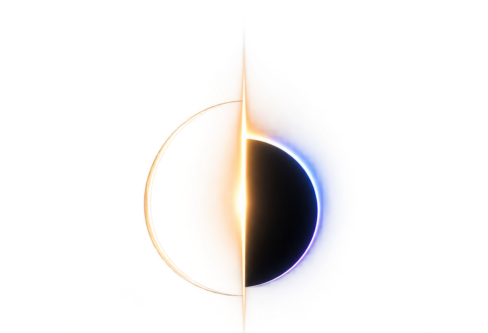

<p align="center">
  
</p>

<h1 align="center">RUDRA</h1>

<p align="center">
  <b>R</b>adiance <b>U</b>niversal <b>D</b>ynamic <b>R</b>ange <b>A</b>dapter<br>
  Turns 8-bit SDR footage into scene-linear HDR — and tells you where it did it.
</p>

<p align="center">
  
  
  
  
</p>

---

## What it does

An 8-bit frame throws away everything above the clip. RUDRA puts it back where
the SDR mapping was non-invertible — blown highlights, crushed shadows — and
leaves every other pixel to the analytic inverse, unchanged.

It ships as a desktop Studio and a delivery CLI.

---

## See it


Three held-out frames. Unknown tone curve, 4:2:0 chroma, banding, JPEG — the
condition real footage arrives in. The analytic inverse has a hard ceiling and
clips into it; the sky goes flat. RUDRA keeps the roll-off the reference has.
HDR columns are stopped down by whole stops so a browser can show them, and the
exposure comes from the reference alone, so nothing is flattered by its own
output.

---

## Install

```bash
git clone https://github.com/fxtdstudios/RUDRA.git
cd RUDRA
pip install -e .
(cd checkpoints && sha256sum -c SHA256SUMS)
```

Then open the Studio — it loads the shipped checkpoint and opens a browser tab:

```bash
python ui/server.py
```

**Scope.** RUDRA is one thing: SDR to HDR for any image or video, whatever made
it — a camera, a phone, an archive, or any generative model. It works on
pixels, not on a model's latent space. The per-backbone VAE decoders (Flux,
Wan, LTX, SDXL, Qwen, Klein) and the latent-conditioning research pipeline are
**paused** as of 23 Sep 2026; their code stays in `rudra/` and `training/`
and their results in [`STATUS.md`](STATUS.md), but they are not part of the
product and are not maintained.

---

## Use it

Convert a complete SDR clip to HDR10, retaining its audio:

```bash
rudra video input.mp4 --output delivery/master_hdr10.mp4 \
    --checkpoint checkpoints/sdr2hdr_shadow_v1.pt --device cuda
```

Run `python -m rudra.video` with the same arguments if the CLI is not installed.
Requires FFmpeg/ffprobe with `libx265` and `zscale`. This command supports
progressive, square-pixel, constant-frame-rate SDR video with even dimensions.
It preserves the rational frame rate and frame count, normalizes video start
time to zero, and keeps audio aligned relative to the video. Audio outside the
video interval is trimmed; all input audio streams are copied by default.
Use `--audio aac` when the input audio codec cannot be copied into MP4.

Colour tags determine the input transfer, primaries, YUV matrix and range.
Missing or unsupported tags require explicit overrides, for example
`--input-transfer rec709 --input-primaries rec709 --input-matrix bt709 --input-range limited`.
Only use those overrides when they describe the source. HDR, alpha-bearing,
interlaced, rotated, anamorphic and variable-frame-rate inputs are rejected
rather than silently changed, except that straight alpha is supported by the
ProRes 4444 preset below. No preset carries subtitles.

The export is 10-bit HEVC, BT.2020/PQ, with measured MaxCLL/MaxFALL and mastering
display metadata. `--peak-nits 1000` selects the mastering peak. The video is
published only after checking dimensions, every frame timestamp, frame count,
colour tags, HDR metadata, audio alignment, and a complete decode. A matching
`.mp4.json` sidecar records the checkpoint hash, settings, per-frame statistics
and QC results. Existing outputs are never overwritten.

Optional `--shadow-smoothing 0.8` smooths the scalar shadow gate and resets it
at detected hard cuts; it does not blend image pixels or constitute a validated
temporal model. It is off by default. Full source dimensions are kept, using
512-pixel tiles by default; `--tile-size 0` runs untiled when memory permits.
The command spools temporary 16-bit PNGs to disk rather than keeping a whole
clip in RAM. Use `--work-dir` to select a disk with space; jobs are not yet
resumable. CPU is the default device, so select CUDA explicitly when available.

Select another delivery preset with `--format`:

| Preset | Output | Signal | Alpha |
|---|---|---|---|
| `hdr10` (default) | MP4/MOV/MKV, HEVC 10-bit | BT.2020 PQ, static HDR10 metadata | No |
| `hlg` | MP4/MOV/MKV, HEVC 10-bit | BT.2020 HLG | No |
| `prores422` | MOV, ProRes 422 | BT.2020 PQ | No |
| `prores422hq` | MOV, ProRes 422 HQ | BT.2020 PQ | No |
| `prores4444` | MOV, ProRes 4444 | BT.2020 PQ | Straight alpha |

```bash
rudra video input.mp4 --output delivery/broadcast_hlg.mp4 --format hlg \
    --checkpoint checkpoints/sdr2hdr_shadow_v1.pt --device cuda
rudra video input.mp4 --output delivery/editorial.mov --format prores422hq \
    --checkpoint checkpoints/sdr2hdr_shadow_v1.pt --device cuda
rudra video transparent.mov --output delivery/composite.mov --format prores4444 \
    --alpha-mode straight --checkpoint checkpoints/sdr2hdr_shadow_v1.pt --device cuda
```

ProRes requires FFmpeg's `prores_ks` encoder. This encoder accepts 10-bit colour
and alpha input planes; a 4444 stream decoding to 12-bit colour or configured
for 16-bit alpha storage does not restore precision lost at its input. Alpha
bypasses reconstruction and grading. Every decoded output alpha pixel is checked
against the input with a tolerance of 128/65535 (two 10-bit steps). Arbitrary
16-bit alpha is therefore **not lossless**. Premultiplied sources must first be
unpremultiplied; `--alpha-mode straight` declares the supplied interpretation.

HLG uses BT.2100's inverse OOTF followed by its OETF, with zero reference black,
the selected peak and the corresponding system gamma (1.2 at 1000 nits). It
does not merely relabel PQ pixels. Saturated values outside legal HLG scene RGB
receive a common RGB gain reduction. HLG has no HDR10 static SEI; ProRes stores
PQ colour tags while mastering/content-light analysis remains in the sidecar.
ProRes MOV's `nclc` atom may omit a separate range flag; conversion uses limited
video range. All presets retain the frame/audio checks and no-overwrite policy.

Reconstruct a frame or a sequence:

```bash
python training/infer_sdr2hdr.py input/ --output-dir out/ \
    --image-checkpoint checkpoints/sdr2hdr_shadow_v1.pt --recovery-mode all
```

Inference also writes float EXR delivery masters at 203 nits per stored unit.
TIFF outputs retain the network's separate 10,000-nit convention. For a nested
input sequence, pass the corresponding output shot directory to delivery.
CUDA is optional — it runs on CPU, slower. `ffmpeg` is needed for video, not
for stills.

---

## The Studio


Drop a frame or a shot. The network runs once per frame on the GPU and hands
the page raw fields; everything after that composes on your own GPU, so the
controls move at frame rate.

| Layer | What it shows |
|---|---|
| **Compare** | RUDRA, the analytic baseline, or a draggable wipe between them |
| **False colour** | luminance zones in nits, against a diffuse white of 203 |
| **Difference** | how far RUDRA moved from the baseline — black means it changed nothing there |
| **Probe** | one pixel: baseline, RUDRA, the delta in stops, and whether the SDR clipped there at all |
| **Scopes** | waveform, RGB histogram and vectorscope, all in nits on a log axis, computed from the frame's own pixels |
| **Frame** | what the frame contains: MaxCLL, MaxFALL, the share above 1 000 nits, and the share the SDR actually clipped |

The bar along the bottom is the colour pipeline, and it is always on: what the
input is being read as, the working space, what the viewer is doing to the
picture, and what the master will be written as. It warns when the frame
carries pixels above the peak the viewer is showing, because an SDR monitor
clipping a highlight looks exactly like a highlight that was never there.

The surround is a neutral grey on purpose — a tinted one biases the judgement
of the picture inside it.

Playback runs at the footage's frame rate, with a read-ahead in front of the
playhead, and the transport reads timecode. Master to OpenEXR in ACES 2065-1
or linear Rec.2020.

### Desktop app (planned)

A native Studio for Windows, Linux and macOS is planned: Qt 6 and OpenGL for the
interface and viewer, a C++20 core, and LibTorch running a TorchScript export of
the model, with no Python at runtime. It is built on the `native` branch; this
browser Studio and the Python CLI stay as they are and remain the reference every
native module is tested against. The state before that work is tagged
`webui-v1`. Plan: [`docs/DESKTOP_APP_PLAN.md`](docs/DESKTOP_APP_PLAN.md).

---

## Results

429 held-out frames, native 1280×720, scene-linear with diffuse white at 1.0.
Whole scenes are held out, so no scene appears on both sides of a split.

| Condition | Method | PU21-PSNR | CVVDP (JOD) |
|---|---|---:|---:|
| **hard** | analytic baseline | 25.92 | 7.362 |
| **hard** | **RUDRA + shadow gate** | **27.15** | **7.751** |
| clean | analytic baseline | 45.99 | 9.448 |
| clean | **RUDRA + shadow gate** | **46.06** | **9.561** |

`hard` is the deployment condition. `clean` is well-graded input, which the
analytic baseline already handles well. The gated configuration is the only one
we have scored that beats the baseline in **both** conditions on **both**
metrics.

> **Read both metrics together.** The ungated model gains +1.43 dB on degraded
> input and *loses* 3.0 dB on clean input — where CVVDP puts the same gap at
> −0.046 JOD, far below a just-noticeable difference. The two instruments
> disagree by two orders of magnitude on identical frames. Quoting the gain
> without the loss, or the clean PSNR without the JOD beside it, misrepresents
> the result in opposite directions.

Full tables, the failure analysis, and how to recompute every number:
[`docs/RESULTS.md`](docs/RESULTS.md).

---

## Documentation

| Document | What is in it |
|---|---|
| [`paper/main.pdf`](paper/main.pdf) | the measured write-up |
| [`docs/RESULTS.md`](docs/RESULTS.md) | every benchmark table, and how to recompute it |
| [`docs/TRAINING.md`](docs/TRAINING.md) | training on your own footage, end to end |
| [`docs/TRAINING_STEPS.md`](docs/TRAINING_STEPS.md) | the next training run, step by step, with the gate each step has to pass |
| [`docs/RETRAIN_RUNBOOK.md`](docs/RETRAIN_RUNBOOK.md) | rebuilding the corpus: sources, licences, the ingest, the gates |
| [`docs/INTERNALS.md`](docs/INTERNALS.md) | the composite, the units, the gate |
| [`docs/CORPUS.md`](docs/CORPUS.md) | what a training set has to contain |
| [`docs/DEVELOPMENT.md`](docs/DEVELOPMENT.md) | repo layout, how it is checked, and the decisions behind it |
| [`STATUS.md`](STATUS.md) | what is finished, what is open, and the next steps in order |
| [`docs/DESKTOP_APP_PLAN.md`](docs/DESKTOP_APP_PLAN.md) | the native desktop Studio: Qt 6, OpenGL, C++20, LibTorch; architecture, phases, acceptance |

---

## Licence

Code is Apache 2.0. **The weights are non-commercial** — the training corpus
is why, and that is not a term FXTD Studios can waive for you. See
[`checkpoints/LICENSE`](checkpoints/LICENSE) and [`NOTICE`](NOTICE).

---

[FXTD Studios](https://fxtdstudios.com) · Cairo
# Resumable video queues

Studio's **Master EXR** renders directly to an absolute **Render folder** on the
computer running Studio. Choose **Current image**, or **All loaded frames —
sequence**, then set the render name and starting frame. A sequence named `shot`
starting at 1001 writes `shot.001001.exr`, `shot.001002.exr`, and matching JSON
sidecars, using loaded frame order and one frozen copy of the current grade.
Existing outputs stop the render before processing; files are never overwritten.
Master keeps the source resolution and does not trigger a browser download.
Keep Studio and the browser open until the render completes. If a sequence stops,
completed frames remain on disk; choose the remaining inputs and matching start
number to continue, or use a fresh render folder.

Save a queue as `queue.json`. Paths resolve relative to that file. Defaults and
per-job `options` accept the same option names as `rudra video` (underscores or
hyphens), without the leading `--`.

```json
{
  "version": 1,
  "defaults": {
    "checkpoint": "checkpoints/sdr2hdr_shadow_v1.pt",
    "device": "cpu",
    "format": "hdr10"
  },
  "jobs": [
    {"input": "clips/shot01.mp4", "output": "masters/shot01.mp4"},
    {"input": "clips/shot02.mp4", "output": "masters/shot02.mov",
     "options": {"format": "prores422hq"}}
  ]
}
```

```console
rudra batch run queue.json
rudra batch status queue.json
rudra batch run queue.json --retry-failed
```

Jobs run sequentially. Progress and errors are saved atomically in
`queue.json.state.json`; a process lock prevents two runners using the same
queue. Repeating `run` verifies SHA-256 hashes of completed video/report pairs,
sources, and weights before skipping them. Failed jobs remain visible and require
`--retry-failed`; other jobs continue. The command returns nonzero if any job is
incomplete. Keep the queue unchanged after starting it; use a new filename for a
revised queue. Use separate output paths across different queues.

Resume is **per clip**: interrupted clips restart from frame one. An existing
output or report is never overwritten. If a crash occurs during final publication
or before completion is saved, review and relocate that job's output/report pair
before retrying. Temporary folders may remain after a hard process termination.

## Validation quality diagnostic

Run a fixed, scene-balanced sample without consuming the final test set:

```console
python training/quality_benchmark.py --manifest outputs/finetune_views_20260920/data/manifest.jsonl --checkpoint checkpoints/sdr2hdr_shadow_v1.pt --out outputs/quality_diagnostic_new --scenes 12
```

The output directory must be new. The tool freezes source and checkpoint hashes,
scores the shipped model against the analytic inverse-ACES baseline at native
resolution on CPU, and writes `REPORT.md`, `summary.json`, and `scores.jsonl`.
It selects one frame per validation scene by a stable hash, then tests clean and
seeded degraded inputs. It reports PU21-PSNR, real ColorVideoVDP image JOD, and
shadow/highlight region errors, with paired bootstrap intervals. Missing metrics
remain unavailable; proxy values never enter the comparison.

This is an image-quality diagnostic, not a motion benchmark or a Ruby comparison.
Candidate training assessment and final held-out testing remain separate. Do not
interpret a small validation sample as proof of general superiority.

To isolate the residual recovery paths on the exact same frozen sample:

```console
python training/recovery_ablation.py --benchmark outputs/quality_benchmark_20260920 --out outputs/recovery_ablation_new
```

This verifies the original source, checkpoint, and implementation hashes, reuses
the original baseline/all-recovery scores, and measures highlights-only,
shadows-only, and recovery-off with real ColorVideoVDP. The new output directory
contains paired comparisons and an ablation report. No inference defaults or
training settings are changed; confirm findings on broader validation before
promoting a different recovery policy.
